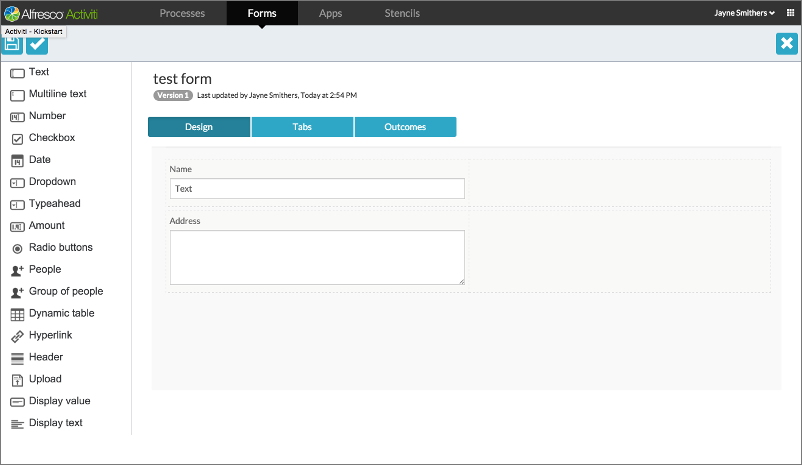

# Form editor

The form editor provides a powerful drag and drop interface to let you design forms from a rich set of controls. You can define form outcomes and create forms with multiple tabs. Individual controls and whole tabs can be made visible depending on the value of other form fields and process variables. You can design your form with groups of controls in varying numbers of columns.

In the example above, the form editor is open on a form containing two controls, a text box, and a multiline text box.

-   **[Form Controls](../concepts/ps-form-controls.md)**  
The form controls for each field determine how the field is displayed and handled.

**Parent topic:**[Process Services Landing Page](../concepts/Landing-page.md)

