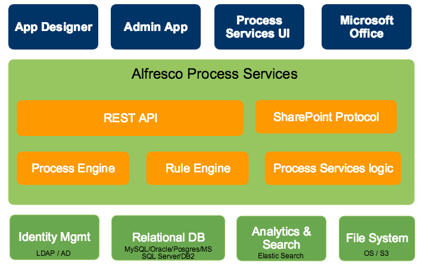

# Alfresco Process Services high-level architecture

The following diagram gives a high-level overview of the technical components in Alfresco Process Services.

Alfresco Process Services is packaged as a standard Java Web application \(WAR file\) that can be deployed in any supported Java web container. The WAR file contains the Java logic, REST API resources, and the user interface HTML and JavaScript files. The application is stateless, which means it does not use any sessions, and requests can be handled by any node in a clustered setup \(see [Cluster configuration and monitoring](cluster_configuration_and_monitoring.md) for more information on multi-node setup\).

**Additional technical implementation details**:

-   The Process Engine \(enterprise edition\) is embedded within Alfresco Process Services and directly used through its Java API.

-   The REST API has two parts:

    -   The REST API that exposes operations in the context of the applications that are part of Process Services. This REST API is used by the user interface and should be used in most cases.

    -   The REST API that exposes the core engine API directly. Note that this interface is intended for highly custom applications as it exposes the full capabilities and data within the Process Engine. Consequently, a user with the *tenant admin* or *tenant manager* role is needed to access this part of the REST API for security reasons.

-   The application requires Java 7 and is compliant with JEE 6 technologies. The process Engine itself also supports Java 6, however for components such as Elasticsearch, Alfresco Process Servicesrequires Java 7 or Java 8. Review the [Supported Stacks](https://www.alfresco.com/services/subscription/supported-platforms) list for more information on supported platforms.

-   The backend logic specific to the Process Services logic is implemented using Spring 4 and JPA \(Hibernate\).

-   All user interfaces are written using HTML5 and AngularJS.

Alfresco Process Services uses the following external systems:

-   A relational database.

-   An Elasticsearch installation. Note that the application ships with an embedded Elasticsearch by default, which requires little configuration.

-   A file system \(shared file system in multi-node setup\) where content is stored.

-   An identity management store such as LDAP or Active Directory \(optional\). By default, a database-backed user and group store is used.

The Process Engine is managed using the Administrator application. This is also provided as a WAR file.

The App Designer is an Eclipse plugin that can be used by developers to create BPMN 2.0 process definitions within their Eclipse IDE. You can also configure the plugin to pull and push process definition models.

The application can also connect to other on-premise or cloud systems, such as Alfresco Content Services, Box, and Google Drive \(not shown in the diagram\).

**Parent topic:**[Administering Alfresco Process Services](../topics/adminGuide.md)

**Parent topic:**[Developer guide](../topics/developmentGuide.md)

