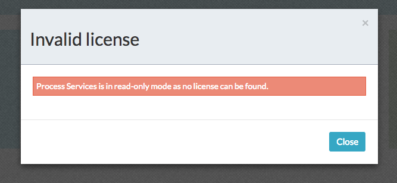
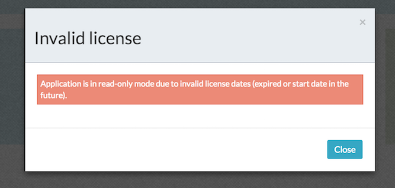

# Licensing Alfresco Process Services

Alfresco Process Services must have a valid license to work properly. Alfresco provides this license in the form of a file named activiti.lic.

-   Move the license file to one of the following locations:

    In the classpath of the web application.

-   In the home folder of the user that was used to start the web container. For example, in the $USER\_HOME/.activiti/enterprise-license/ folder \(note the dot before *activiti*\).

Alternatively, upload it using the instructions in [Uploading a license from the User Interface](uploading_a_license_from_the_user_interface_ui.md).

**Note:** On starting the Process Services web application, Alfresco checks for an installed license. If a license cannot be found, the following message is displayed:

If a license is found, Alfresco checks the license validity dates. If these are invalid, the following message appears:

**Parent topic:**[Administering Alfresco Process Services](../topics/adminGuide.md)

