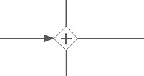

# Parallel gateway

You use a parallel gateway to model concurrency in a process. It allows you to fork multiple outgoing paths of execution or join multiple incoming paths of execution.

A parallel gateway is visualized as a diamond shape with a plus icon:

In a fork, all outgoing sequence flows are followed in parallel, which creates one concurrent execution for each sequence flow.

In a join, all concurrent executions arriving at the parallel gateway wait at the gateway until an execution has arrived for every incoming sequence flow. Then the process continues past the joining gateway. Note that the gateway simply wait until the required number of executions has been reached and does not check if the executions are coming from different incoming sequence flow.

A single parallel gateway can both fork and join, if there are multiple incoming and outgoing sequence flow. The gateway will first join all incoming sequence flows, before splitting into multiple concurrent paths of executions.

**Unlike other gateways, the parallel gateway does not evaluate conditions. Any conditions defined on the sequence flow connected with the parallel gateway are ignored.**

|Property|Description|
|--------|-----------|
|Id

|A unique identifier for this element.

|
|Name

|A name for this element.

|
|Documentation

|A description of this element.

|
|Asynchronous

|\(Advanced\) Define this task as asynchronous. This means the task will not be executed as part of the current action of the user, but later. This can be useful if it’s not important to have the task immediately ready.

|
|Exclusive

|\(Advanced\)Define this task as exclusive. This means that, when there are multiple asynchronous elements of the same process instance, none will be executed at the same time. This is useful to solve race conditions.

|
|Flow order

|Select the order in which the sequence flow conditions are evaluated. Note that for a parallel gateway this is not important, as conditions are not evaluated.

|

**Parent topic:**[Gateways](../topics/gateways.md)

