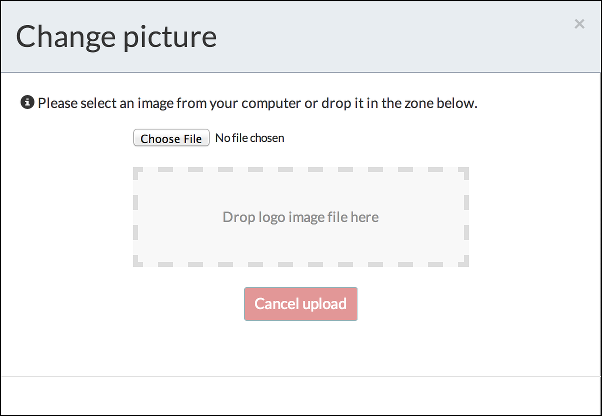

# Personal profile

Before you get started, you may want to do is add a photo to your profile, so click **Profile management**.

On the **Personal** page you can edit your details, such as your name, change your password, and view your group membership and capabilities.

To add your photo, click the image to the left of your name and upload the desired photo.

**Parent topic:**[Using Alfresco Process Services](../topics/userGuide.md)

