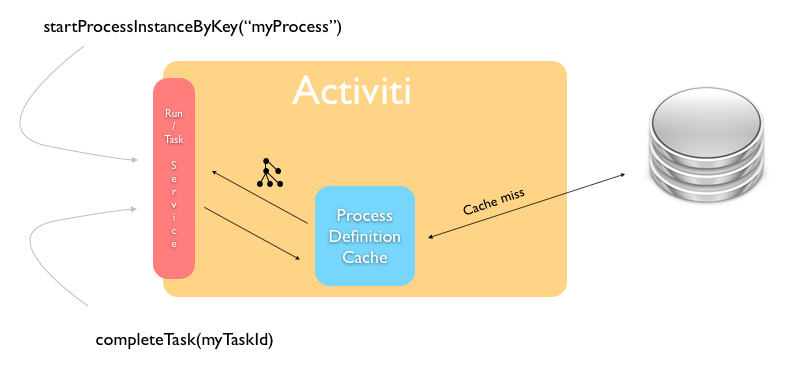

# Process Definition Cache

The Process Engine operates in a stateless way. However, there is data that will never change, which makes it a prime candidate for caching.

A process definition is an example of such *static data*. When you deploy a BPMN 2.0 XML file to the Process Engine, the engine parses it to something it can execute, and stores the XML and some data, such as the description, business key, in the database. Such a process definition will never change. Once it’s in the database, the stored data will remain the same until the process definition is deleted.

On top of that, parsing a BPMN 2.0 XML to something executable is quite a costly operation compared with other engine operations. This is why the Process Engine internally uses a process definition cache to store the parsed version of the BPMN 2.0 XML.

In a multi-node setup, each node will have a cache of process definitions. When a node goes down and comes up, it will rebuild the cache as it handles process instances, tasks. and so on.

The process definition cache size can be set by the following property:

|Property

|Description

|Default

|
|activiti.process-definitions.cache.max

|The number of process definitions kept in memory. When the system needs to cope with many process definitions concurrently, it is advised to make this value higher than the default.

|128

|

**Parent topic:**[Configuring Alfresco Process Services](../topics/administration_application_config.md)

