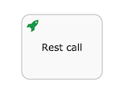
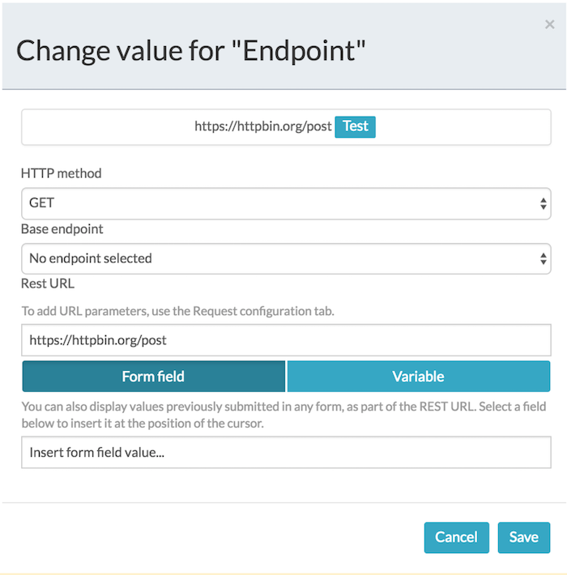
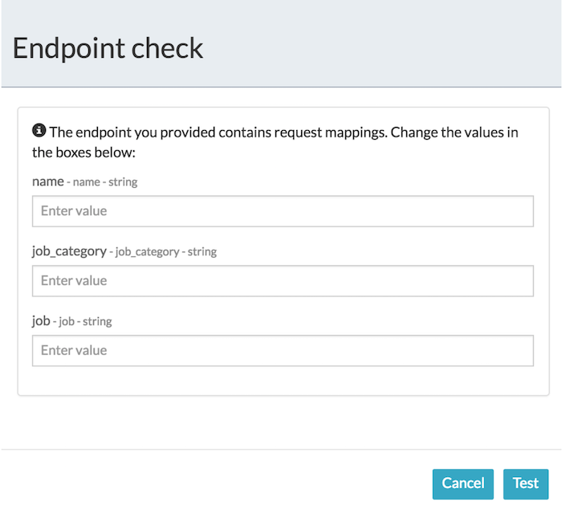
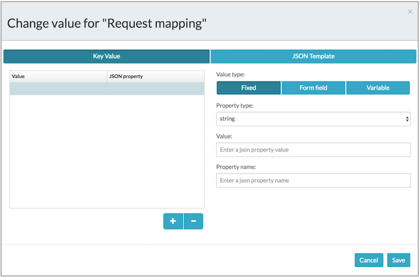
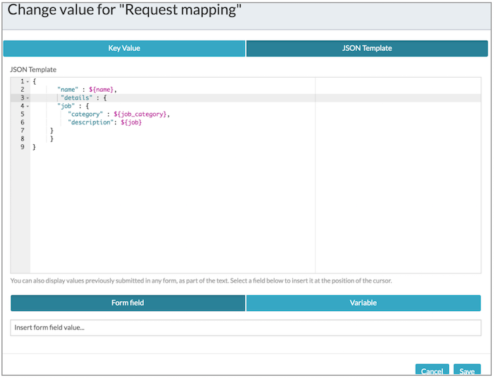

# Rest call task

The rest call task is used to communicate with a REST endpoint. The endpoint can be defined in the process definition, or it can be defined company-wide by an administrator. In the latter case, a logical name is all that is needed.

A rest call task is visualized as a rounded rectangle with a rocket icon the top-left corner.

Note that the REST call task always is executed asynchronously.

|Property|Description|
|--------|-----------|
|Id

|A unique identifier for this element.

|
|Name

|A name for this element.

|
|Documentation

|A description of this element.

|
|Endpoint

|Defines which REST endpoint to call. It is an endpoint defined company-wide by the administrator \(simply select a logical name in the dropdown\) or a URL. You can also use a previously defined form fields or variables to build up the URL.

 Use the **Test** button to test the end-point.

 

 If the request mapping \(see next property\) contains key/value properties or a JSON template, you will be prompted to provide test values for the parameters before the endpoint is tested.

 

|
|Request mapping

|Allows to construct the actual request. HTTP GET represents the URL parameters whereas POST/PUT is the JSON body that is created when the request is sent. You can also use fixed values, form fields, or variables defined prior to this activity.

 

 For nested or complex request bodies for POST requests, you can specify a JSON Template which is evaluated at run-time.

 

 The JSON editor provides syntax highlighting and will highlight any JSON syntax errors on the line number indicator.

|
|Response mapping

|Maps the JSON response from the REST endpoint to process variables. You can use a nested notation \(for example `prop1.prop2.prop3`\) for mapping values. The mapped response values can be used as variables in further steps of the process.

|

**Parent topic:**[Activities](../topics/activities.md)

