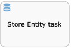

# Store Entity task

Use the Store entity task to update data models or entities with process values such as variables or form fields. The updated entities can then be mapped to variables and used while creating processes.

|Property|Description|
|--------|-----------|
|Id

|A unique identifier for this element.

|
|Name

|A name for this element.

|
|Documentation

|A description of this element.

|
|Attribute mapping

|Attributes mapped for this element instance. Click to invoke the Change value for "Attribute Mapping" dialog, where you can map entities or Data Models with form fields and variables used in your process. See the [Data Models](data_models.md) section for more details.

|

**Parent topic:**[Activities](../topics/activities.md)

