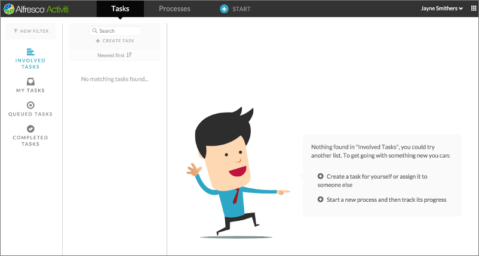

# Task App

Use the Task App to access your task list and work on tasks assigned to you from the Processes tab. This is also where you initiate new processes and tasks.

The Task App menu bar has tabs for working with tasks, processes, reports, and a Start button, which is a shortcut to start a process using a published process definition.

**Note:** If you haven’t created any tasks for yourself, and there are no tasks assigned for you from current processes or from other users, then James will appear with shortcuts to help you create a task or start a published process.

-   **[Tasks tab](../topics/tasks_tab.md)**  
The Tasks tab is organized into three columns.
-   **[Processes tab](../topics/processes_tab.md)**  

-   **[Reports tab](../topics/reports_tab.md)**  

**Parent topic:**[Process Services Landing Page](../concepts/Landing-page.md)

