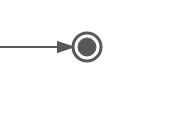

# Terminate end event

When a terminate end event is reached, the current process instance or sub-process will be terminated. Conceptually, when an execution arrives in a terminate end event, the first scope \(process or sub-process\) will be determined and ended. Note that in BPMN 2.0, a sub-process can be an embedded sub-process, call activity, event sub-process or transaction sub-process. This rule applies in general, for example, when there is a multi-instance call activity or embedded subprocess, only that instance will be ended, the other instances and the process instance are not affected.

|Property|Description|
|--------|-----------|
|Id

|A unique identifier for this element.

|
|Name

|A name for this element.

|
|Documentation

|A description of this element.

|
|Execution listeners

|Execution listeners configured for this.

|

**Parent topic:**[End events](../topics/end_events.md)

