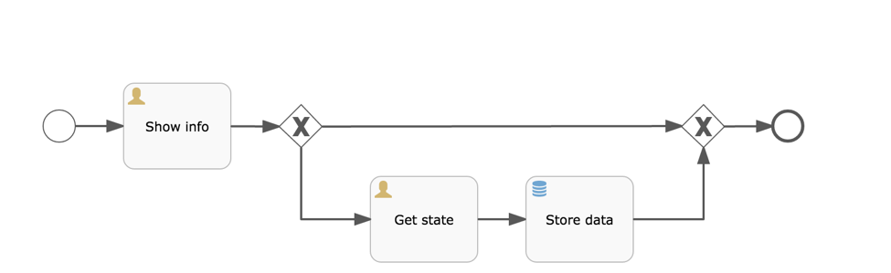
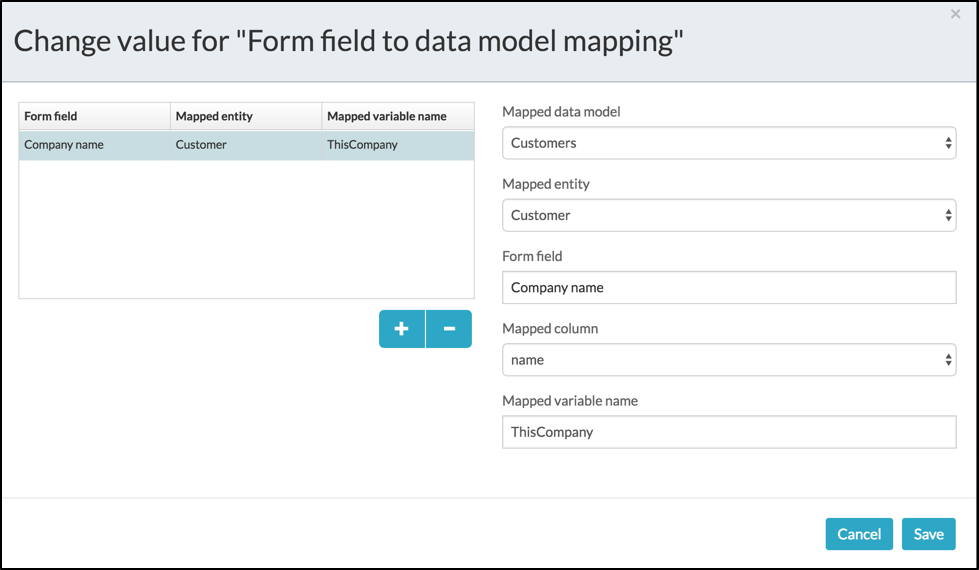
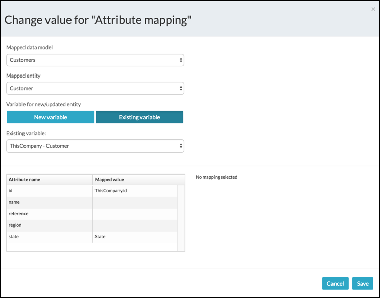
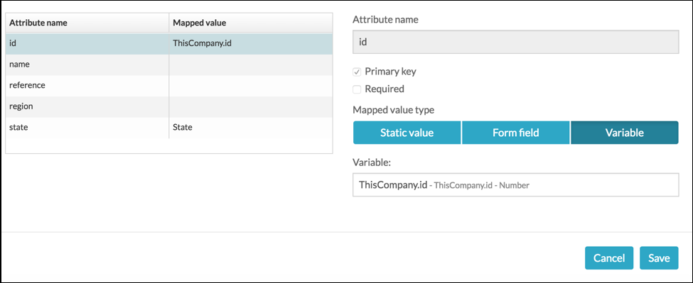

# Using data model in your processes

Once you have defined the data model for a database data source, the next step is to use them in forms, decision tables, and process conditions, by mapping them into form fields or process variables. For example, to use patients’ information, you can map their information such as their name and address into your forms.

**To start accessing data using your data model:**

1.  From the **App Designer**, create a simple business process model with a BPMN task that includes a Start event, Store entity task, and an End task.

    

2.  From the BPMN editor, select the Start event and then click **Referenced Form** to select an existing form, or create a new form. The Form reference dialog box appears.
3.  Select the form that you want to customize and click **Open**.
4.  In the selected form, drag a text type field from the palette, rename it as Company name and then save it.
5.  From the BPMN editor, click **Form field to data model mapping**. A dialog box to change value for form field to data mapping appears.
6.  Map the fields for Company Name as shown below:

    

7.  From the BPMN editor, click the **Store entity task** and then **Attribute mapping** to edit the mappings. The Change value for Attribute mapping dialog box appears.

    

8.  Select the **Mapped data model** and **Mapped entity**.
9.  Add a new variable or use an existing variable. In this case, select an existing one: *ThisCompany – Customer*.
10. Map the attribute names with mapped value by selecting the required attribute in the Attribute table as shown below:

    

11. Configure the variable for the selected mapping, and then click **Save**.
12. Publish your app and verify the data connection by making changes to the process data.

**Parent topic:**[Data Models](../topics/data_models.md)

