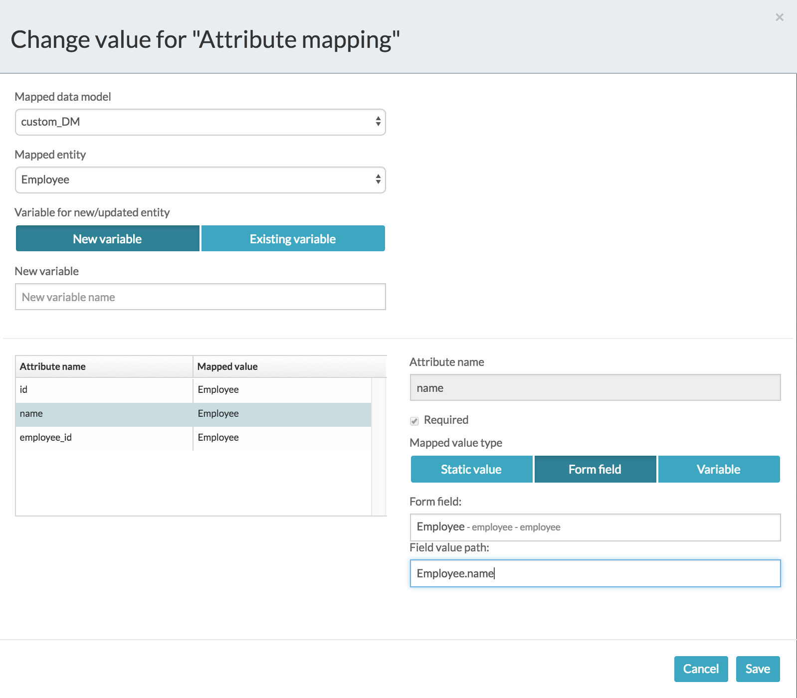

# Mapping Complex Custom Control Values

Process Services provides capability to write data from a complex custom control to a data model, allowing the data in the custom control to be externalized.

Developers can define a ‘value path’ that is stored in Process Services and made available to the developer at runtime, allowing them programmatic access to the information in the custom control. This information can then be extracted into a custom data model.

The implementation uses the Alfresco data model service AlfrescoCustomDataModelService to connect the custom data models to external sources and perform custom data operations. The value path should be injected into the wrapper bean class to make it available with the mapped complex data model field at application runtime. The value path value is stored in JSON format in the database.

An optional 'Field value path' is available for custom controls in the **Attribute mapping** for the 'Store Entity task'.

1.  From the BPMN editor, click the Store Entity task containing your attribute mappings.
2.  Click **Attribute mapping** to edit the mappings. The **Change value for Attribute mapping dialog** dialog box appears.

    

3.  Click on an entry in the Attribute table and then click the **Form field** tab.
4.  Select the custom control from the **Form field** dropdown list and assign a value path in the **Field value path** field.
5.  Click **Save** to save your changes.
6.  The values from the custom control will be made available in the specified value path at runtime.

**Note:** The developer must manage the protocol for storing data in a custom control \(such as JSON in a text field\) and the data extraction scheme \(such as the developer implemented and documented syntax for extraction\) for mapping custom control values.

**Note:** The developer is also responsible for taking the data storage protocol and mapping scheme available to them and writing values to the custom control. This also extends to making sure the field value path is specified correctly, as exception handling is not included.

**Parent topic:**[Using data model in your processes](../topics/using_data_model_in_your_processes.md)

