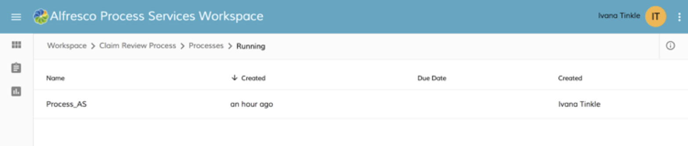

# Working with processes

Process Workspace lets you view existing processes and create new processes.

The **Processes** list shows the details of the currently running processes.

To view your processes, click .

If you are using the expanded menu, you can see a more complete list of processes and you can filter the list for **Running**, **Completed** and **All** processes.

New processes that you create will appear in this list.

Double-click on a row in the process list to see a list of active tasks. Below this, a process diagram of the active process appears.

-   **[Create process](../tasks/pw-create-process.md)**  
Create new processes for yourself or for other to use.
-   **[View process details and activity](../tasks/pw-view-process.md)**  
You can view the detailed information about your active processes.
-   **[View process workflow](../tasks/pw-view-process-workflow.md)**  
You can view the workflow for the process.
-   **[Use Process Workspace in another language](../tasks/pw-language.md)**  
The default language used in Process Workspace is English. You can change the language.

**Parent topic:**[Alfresco Process Services Workspace](../concepts/pw_using_intro.md)

