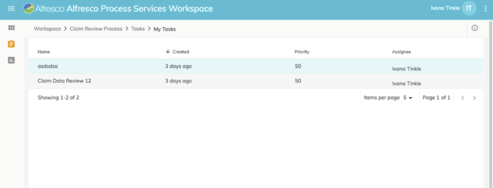

# Working with tasks

Process Workspace lets you view existing tasks and to create new tasks. The task list lets you work on tasks assigned to you from any process app.

You can see all of the tasks that you are working with on the **My Tasks** list. To view your tasks, click .

You'll see the **My Tasks** page, which shows the tasks created within this app or as part of the processes from the app. New tasks that you create will appear in the **My Tasks** list.

To view a task, double-click on a task in the task list. A new page opens showing the task form. This provides options to save, approve or reject the task.

You can control the number of tasks displayed on the page. Click the down arrow next to **Items per page** and select a value from the list. The page refreshes to display the number of items you chose.

To view a task, double-click on a task in the task list. A new page opens showing the task form. This provides options to save, approve or reject the task.

-   **[Create task](../tasks/pw-create-task.md)**  
Create new tasks for yourself or to assign to others.
-   **[View task details and activity](../tasks/pw-view-task.md)**  
You can view the detailed information about your active tasks.
-   **[Attach files to a task](../tasks/pw-task-attachment.md)**  
You can upload a file that you wish to be attached to a task.
-   **[Task audit PDF](../tasks/pw-task-audit-PDF.md)**  
 Process Workspace lets you download a PDF file that shows a summary of the task, including the task details and activity. This file is called the Task Audit.

**Parent topic:**[Alfresco Process Services Workspace](../concepts/pw_using_intro.md)

