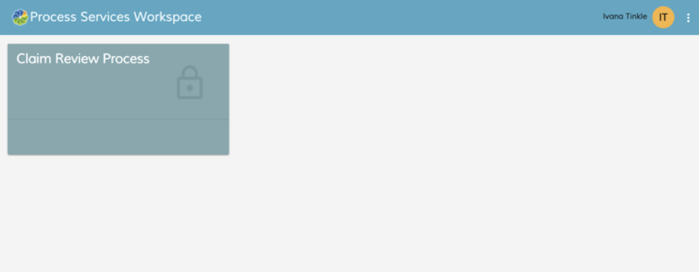

# Process Workspace Apps Page

When you log in to Process Workspace, you'll see your Apps Page displaying the tiles that you have available. Each tile shows a process definition that gives you tools for a distinct set of tasks.

In the following image, you'll see that there is a **Claim Review Process** tile. Your Apps Page may show more tiles.

Click on an apps tile to display the Process Workspace dashboard for this .

**Parent topic:**[Alfresco Process Services Workspace](../concepts/pw_using_intro.md)

