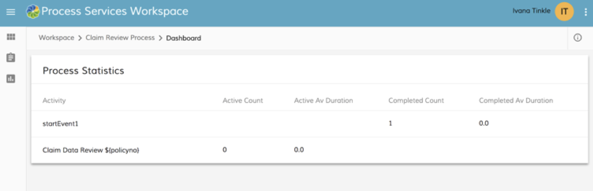
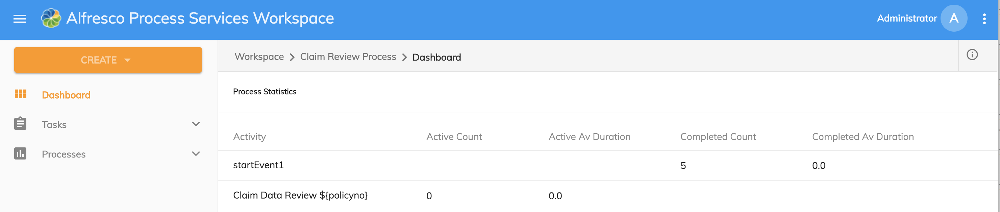
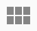

# Process Workspace Dashboard

The Process Workspace dashboard lets you review the statistics for a process definition. This information gives you an overview of the activity.

The Process Workspace dashboard has two menu modes:

-   Minimized
-   Expanded

When you first open the dashboard, you'll see the minimized menu mode.

The following image shows the Process Workspace dashboard with the minimized menu. Your menu choices are shown on the left side of the dashboard.

To change to the expanded menu mode, click . The following image shows the Process Workspace dashboard with the expanded menu.

The following information is available on each activity.

|Statistic|Description|
|---------|-----------|
|Activity|The name of the activity.|
|Active Count|The number of activities that are active.|
|Active Average Duration|The average time spent on an activity.|
|Completed Count|The number of completed activities.|
|Completed Average Duration|The average time taken to complete an activity.|

When you are using Process Workspace, you can return to the Dashboard by clicking .

-   **[Changing the Dashboard Settings](../tasks/PW-dashboard-settings.md)**  
The Dashboard Settings lets you filter the data for the current process to customize the information on the dashboard.

**Parent topic:**[Alfresco Process Services Workspace](../concepts/pw_using_intro.md)

