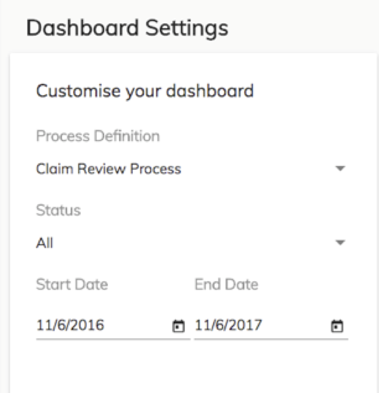

# Changing the Dashboard Settings

The Dashboard Settings lets you filter the data for the current process to customize the information on the dashboard.

1.  Click .

    

    The **Dashboard Settings** pane displays in the right-side of the dashboard.

2.  Change the settings to display the statistics that you want.

    -   **Process Definition** - select an alternative process definition to display
    -   **Status** - select **All**, **Complete**, or **Active** events
    -   **Start Date** and **End Date** - select the date range for the events
3.  Click  to close the **Dashboard Settings** pane.

**Parent topic:**[Process Workspace Dashboard](../concepts/pw_dashboard.md)

