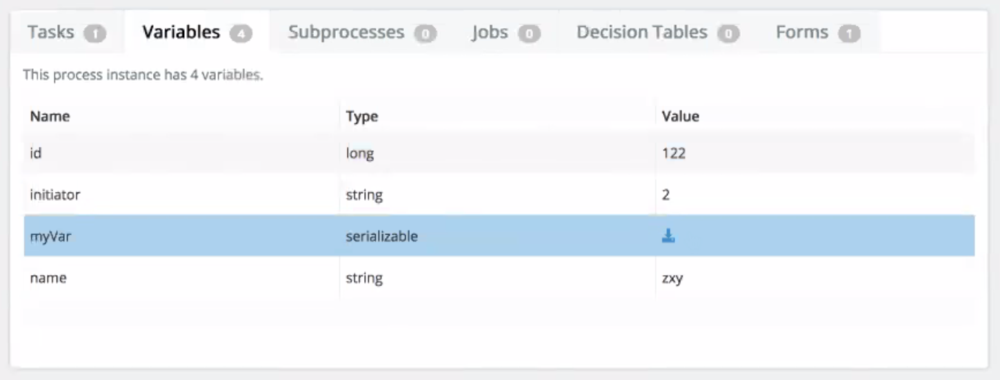

# Downloading binary process data files

Sometimes, you may experience an issue with a process and you need to resolve the problem. The Administrator app gives you the option to download the binary process data for use in troubleshooting and investigating process issues.

1.  Go to the Administrator app and then click **Instances**.

2.  Find the binary process data content from the variables list.

    

3.  Click the **download** button.

    The  button appears for binary file only as the process designer detects the underlying object type.

    The binary process data file is downloaded to the local machine. The file is provided in a serialized binary format.

    **Note:** It is not possible to upload binary process data files.

**Parent topic:**[Using Administrator application](../topics/using_administrator_application.md)

