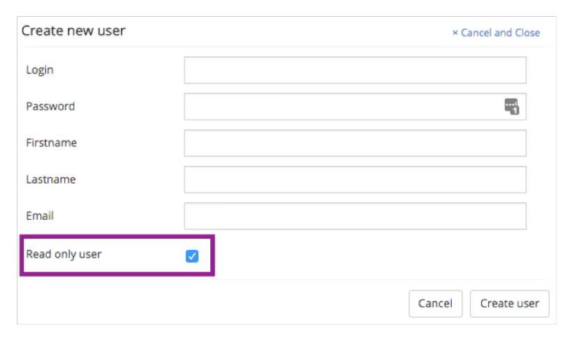

# Read-only access to the Administrator app

You may have users in your organization who assist when debugging problems and need to access the information in the Administrator app, but who don't need to make changes. You can give these users permission for read-only access to the Administrator app. This ensures that these users are able to contribute to issue trouble shooting without accidentally breaking any operational processes.

A read-only user can log in just like any other user but their permissions control the ready-only option.

**Note:** The read only admin is a feature to avoid accidental changes to the system by trusted users. If you don’t trust such a user, we do not advise giving them access to a read only admin view account. This feature ensures a level of security for the UI only and it is possible for a user with read-only UI permission to make changes through the REST API.

1.  Create the user in the Administrator app.

2.  Click the **Read only user** check box.

    

3.  Click **Create user**.

    The new user can log in and access the Administration app but does not have the ability to make any changes.

**Parent topic:**[Using Administrator application](../topics/using_administrator_application.md)

