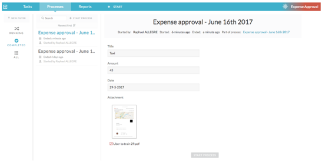

# Use your first process app

When you’ve created and published a process app, it can be used to request a new expense for approval

1.  Click the Expense Approval app on your dashboard then click **Start**.

2.  Complete the requested information and click **Start Process** to submit the new expense.

    

    The Processes page now shows the new expense approval request. From here you can add comments or cancel the process.

    If you click **Show diagram** you can see the current status of your expense claim. The active user task is highlighted in green to indicate it's at review stage. Click **Close** to go back to the claim.

    

3.  Click **Review** under Active Tasks to review the claim.

    **Note:** This would usually be done by a user with the required approval level.

    

4.  Click **Approve** to complete the task.

    This completes the claim as it is now at the end of the process flow.

    **Note:** To review completed tasks click the **Processes** tab, then click **New Filter** and select **Completed as the Process State**.

    

    You can click **Audit Log** to download a PDF audit report. The template used for the Audit Log is part of the configuration settings and can be customized to your specific needs.

Now that you’ve set up and used your first process app, check the rest of the documentation to learn more advanced uses of Alfresco Process Services.

**Parent topic:**[Getting Started with Alfresco Process Services](../topics/getting-started.md)

