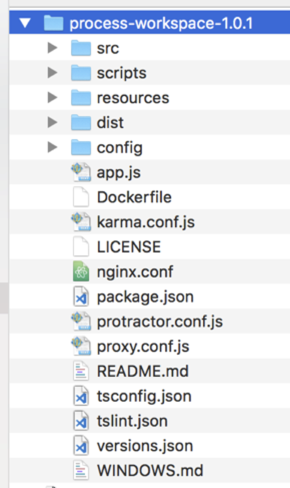

# **Deploying Process Workspace**

Process Workspace is a front-end application that is packaged and deployed separately from the Process Services application \(activiti-app\). This describes how to deploy Process Workspace in Tomcat.

Ensure that you have the following:

-   Tomcat web application installed

1.  Download the latest version of Process Workspace.

    The process-workspace file has this naming convention: process-workspace-$\{version\}.tgz. For example, download process-workspace-1.0.1.tgz.

2.  Unzip the process-workspace-1.0.1.tgz file.

3.  Open the unzipped folder in your preferred IDE.

    You will see the Process Workspace app structure as shown in the following image:

    

    This directory can be published on any web application server and the index.html file will serve the application.

4.  Rename the distribution folder with the name you want to see in the URL of your server. For example, use `process-workspace`.

5.  Paste the renamed folder under the folder /webapps in Tomcat.

6.  Start the Tomcat server.

7.  Open a browser and go to `localhost:8080/process-workspace`.

    The app is running.

**Parent topic:**[Alfresco Process Services Workspace](../concepts/pw_using_intro.md)

