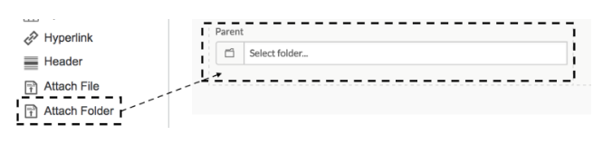
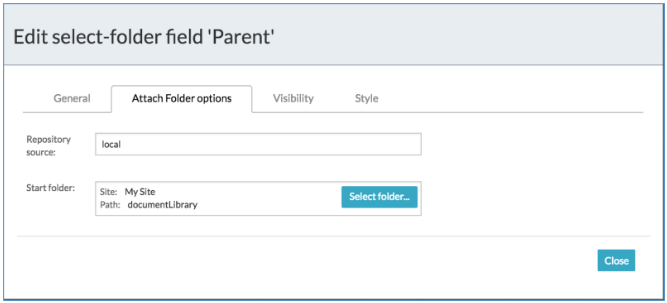
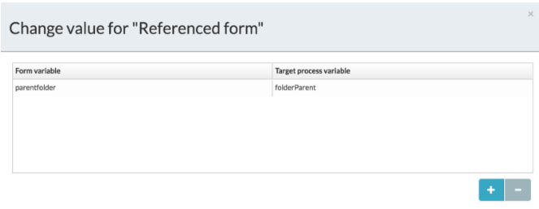
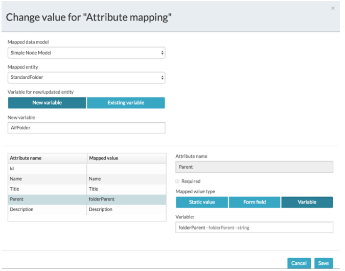

# Configuring the folder entity parent

To create a folder entity you need to provide a parent for the entity parent folder. This can be configured in three different ways.

1.  As part of an end-user form

    1.  Specify the folder entity parent as in [Creating folder entities](ps-create-folder-entity.md).

    2.  In the Form Designer drag and drop the new **Attach Folder** field.

        

    3.  Click the configure option  for the new field to display the Field Configuration screen.

    4.  Click **Attach Folder options**.

        

    5.  Enter the Repository source.

        This is the Alfresco Content Services repository where folder entities will be stored.

    6.  Click **Select folder** for the Start folder and select a parent folder.

        This is the folder under which the folder entity will be stored.

        You can choose whether to allow users to change the default value and select a new folder. This means the user can select folders in collaborative processes where folders are available. This also allows administrators to provide folder-based grouping of content. For example, the administrator can define a number of different folders for each region.

        Alternatively, you can hide this field and enforce a single parent throughout the process application.

2.  Default parent setting via a configuration process

    This is a variation of the previous method. The parent folder is created and stored as the default for other processes to store all their folder entities.

    1.  Create a form to use to configure the parent folder.

    2.  Use variable mapping to map the Attach Folder field to a process variable, for example *folderParent*.

    

    You can now use the default folder parent value in various ways, including:

    -   Storing it as a persisted configuration setting and using in other processes
    -   Mapping it to a model attribute in the Store Entity task
    

    This method stops the user from knowing the details of where the entity is stored. You'll need to create a process starting with a form that allows the user to select a parent folder.

3.  Programatically

    The previous approach is possible because parent folder information is stored in a process variable as JSON, for example:

    \{"path":\{"id":"47cb278d-c775-444f-a23e-b9f2d92390da","title":"documentLibrary \> my-folder","folderTree":\[\{"id":"ec5eb0ec-76a0-4175-adbf-dcf3842ed00c","title":"documentLibrary","simpleType":"folder","folder":true\},\{"id":"47cb278d-c775-444f-a23e-b9f2d92390da","title":"my-folder","simpleType":"folder","folder":true\}\]\},"account":\{"id":"alfresco-1","name":"local"\},"site":\{"id":"health-care","title":"health care"\}\}

    The Store Entity task can recognize the JSON format and extract the values needed. Process developers can construct the parent folder dynamically in code, scripting, or expressions, and store it in a process variable.

**Parent topic:**[Using folder entities in process applications](../concepts/ps-folder-entities.md)

