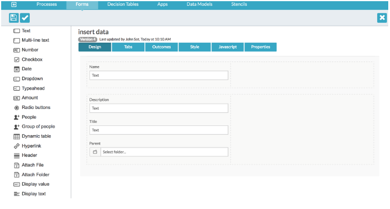
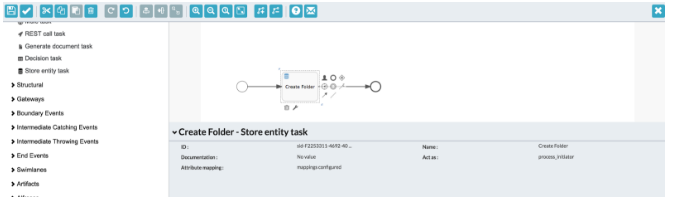
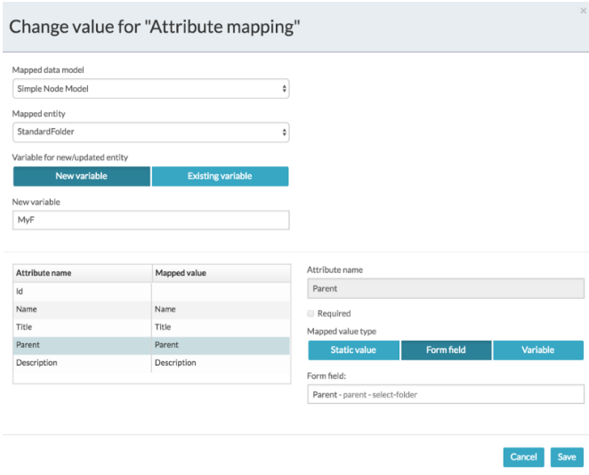
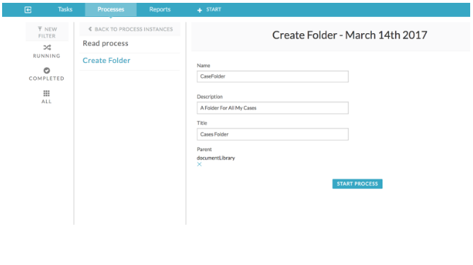
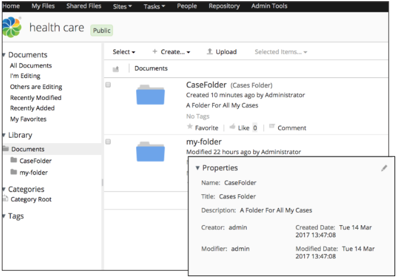

# Creating folder entities

You can create an Alfresco Content Services folder entity in Alfresco Content Services repository with the folder metadata.

1.  In the App Designer create a new or open an existing process in the BPMN Editor.

2.  Create a new BPMN process and add your logic to collect the folder entity data.

    This is usually a form with the appropriate fields, as in the following example. This example uses a form to provide the Name, Description, and Title for the folder entity and under the parent folder, and is used as the referenced form of the start task.

    

3.  From the Components List of the BPMN Editor, drag and drop a **Store Entity Task**.

4.  Select the Store Entity Task and make it a Create Folder.

    

5.  Click on the **Attribute Mapping** property.

6.  From the Mapping Configuration screen select the relevant data model. In this example the Simple Folder Model is used.

7.  Click **New variable** to store the result of creating an folder entity. In this example MyF is used.

    This can be used in expressions, parameters, and other mappings later on in the process. Use this variable to retrieve the ID of the folder entity for future operations such as update or retrieve.

8.  For each folder data model attribute listed in Attribute name, select a form field to use for mapping the form fields to the attributes to be stored. You can also select process variables, but in this example the values from the form are used.

9.  Leave the Id attribute empty.

    This indicates to the task that a new folder should be created. Specifying the Id updates an existing folder.

10. Enter a Name attribute to be used as the name of the new folder.

11. Click **Save**.

    

12. Save the process then publish and deploy the application.

13. Start a process and enter the details in the start form.

    

14. Click **Start Process**.

    The new process instance is created. You can sign in to Alfresco Share and see the new folder created, and see that in the properties the Name, Title, and Description are set to the values entered in the form.

    

**Parent topic:**[Using folder entities in process applications](../concepts/ps-folder-entities.md)

