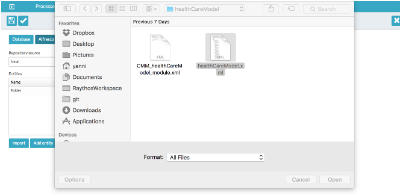
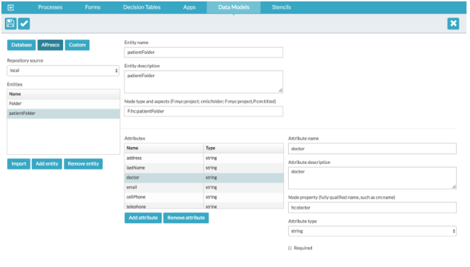

# Importing content models

With Alfresco Content Services you can define and use custom content models using either XML or the Alfresco Share Model Manager. You can import content models and use them in your data models.

See [Model Manager](http://docs.alfresco.com/5.2/concepts/admintools-cmm-intro.html) for more details.

1.  Export the model from Alfresco Content Services.

2.  Unzip the downloaded file.

    This creates a folder with two XML files.

    -   the content model definition, with a file name similar to <content model name\>.xml
    -   the content modeler configuration file with a file name similar to *CMM\_<content model name\>\_module.xml*. This is only required for re-importing a model into Alfresco Share so isn't relevant for the import operation.
3.  In the App Designer select **Data Models** and create a new \(or edit an existing\) folder data model.

4.  On the Entities list click **Import**.

    This prompts you to select the content model file.

5.  Go to the location of the unarchived file and select the content model file, for example, healthCareModel.xml. Ignore the CMM<mode name\> \_module xml file.

    

6.  Click **Open** and the corresponding entry and attributes are created.

    

    Unlike database schemas, importing a content model doesn't overwrite an existing entity if it's currently selected. If the name already exists then an error will be displayed. If it doesn't exist then a new entity is created with the content models using the type name \(*<type name=”.. \>*\) as the entities name.

    You need to activate the content model in Alfresco Share to use it in deployed process applications.

**Parent topic:**[Data Models](../topics/data_models.md)

