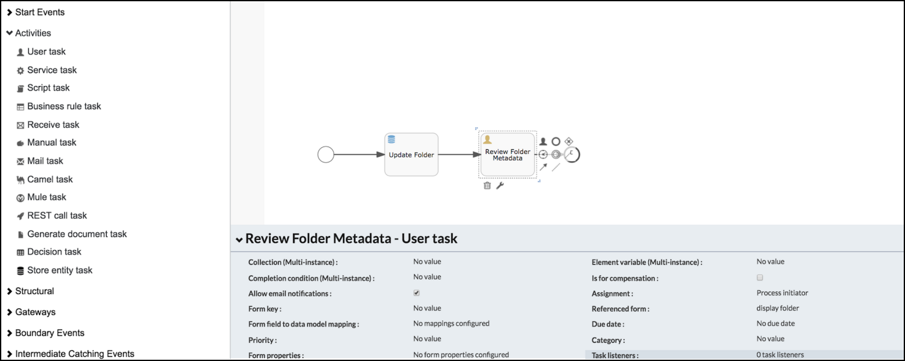
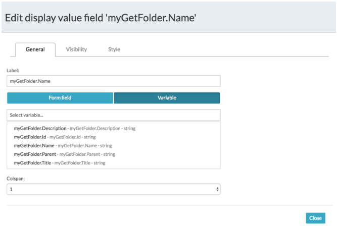
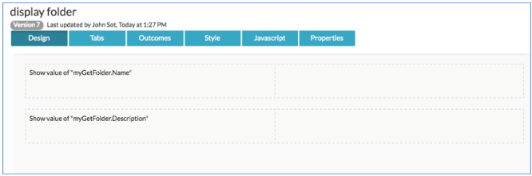
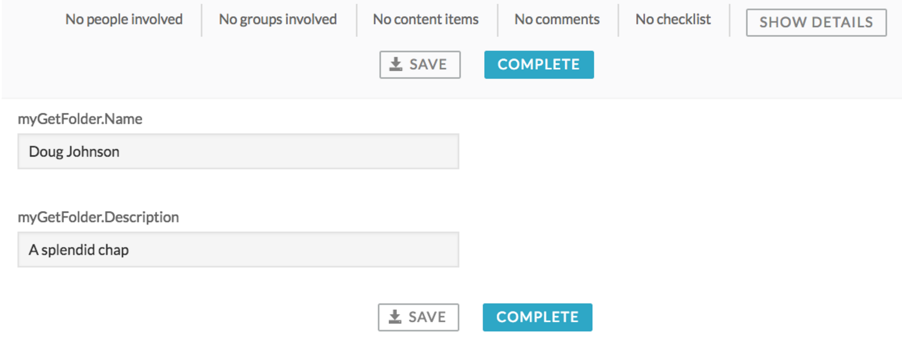

# Retrieve and use a folder entity

As with other data models, there are two ways you can retrieve Alfresco Content Services folder entities and use them in a process or decision table.

1.  Using the form field to data model mapping

    Using the **form field to data model mapping** property in a start or user task to map the form fields to the models attributes. Follow the same process described in [Using data model in your processes](../topics/using_data_model_in_your_processes.md).

2.  Using variables obtained from Stored Entity tasks

    When creating or updating folder entities, the entity can be stored in a variable.

    **Note:** *MyF* and *GetMyFolder* were the examples in [Creating folder entities](ps-create-folder-entity.md) and [Updating folder entities](ps-update-folder-entity.md).

    These variables can then be used in the process expressions and parameters, forms, or decision tables. To use a variable in a form:

    1.  Extend the example you created in [Updating folder entities](ps-update-folder-entity.md) by adding a User Task action.

    2.  Create a new form display folder.

        

    3.  From the form control toolbox drag and drop a Display Value field.

    4.  Use the field configuration to select the variable.

        **Note:** The myGetFolder variable is an object with all the model attributes listed.

    5.  Select a Name and Description.

        

        

    6.  Click **Save**.

    7.  Save the process then publish and deploy the application.

    8.  Create a new process and then [create folder entities](ps-create-folder-entity.md) and [update folder entities](ps-update-folder-entity.md).

        After updating the folder entity a new task is created which uses the Display Folder name to show the entity attributes.

**Parent topic:**[Using folder entities in process applications](../concepts/ps-folder-entities.md)

