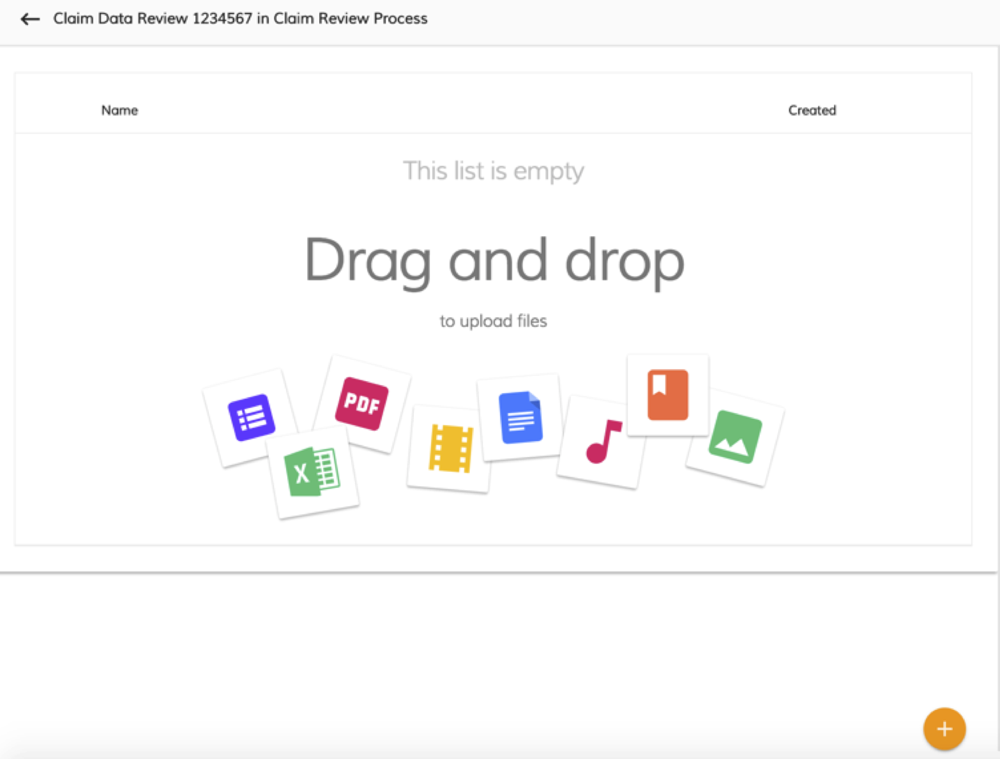

# Attach files to a task

You can upload a file that you wish to be attached to a task.

1.  From the **My Tasks** page, click on a task, and then click  on the right-side.

2.  Click **ACTIVITY**.

    An attachment page appears.

    

    Drag and drop files to this page. You can also click  to upload files using your file browser.

You will see the list of files in the attachment page.

**Parent topic:**[Working with tasks](../concepts/pw-working-with-tasks.md)

