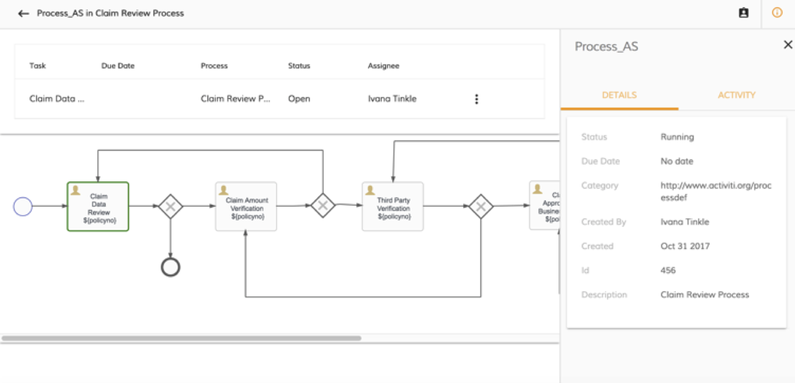

# View process workflow

You can view the workflow for the process.

The left-hand pane displays a list of active tasks, below which a diagram of the process model appears.

1.  From the **Processes** list, double-click on a process.

    You'll see a list of active tasks and the process workflow diagram for this process.

    

2.  Click  and click **View Task**.

    You'll then see the detailed information for the current task.

3.  Click  to return to the **Processes** list.

**Parent topic:**[Working with processes](../concepts/pw-working-with-processes.md)

