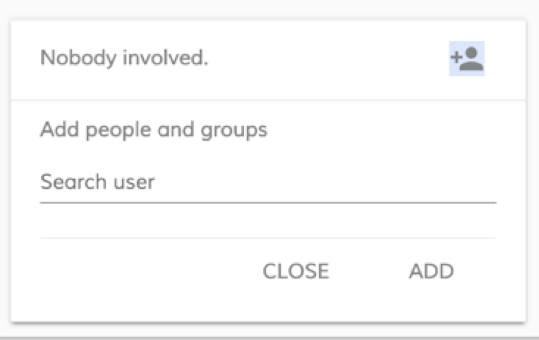

# View task details and activity

You can view the detailed information about your active tasks.

1.  From the **My Tasks** page, single click a tasks in the list to select it.

    You'll see the **Details** and **Activity** tabs on the right side of the page. The **Details** tab displays information about the currently selected task. The **Activity** tab allows you to add comments related to the task.

2.  Click **Details**.

    You'll see the information about the task.

    -   **Assignee** - shows to whom the tasks is assigned.
    -   **Status** - shows the status of the task, which can be running, completed
    -   **Priority** - shows a number that represents the priority of the task.
    -   **Due Date** - shows the due date of the tasks or you can add a date by clicking  and selecting the date from the calendar.
    -   **Category** - shows any associated categories
    -   **Parent Name** - shows the name of the process app to which this task belongs
    -   **Created By** - shows the name of the person who created this task
    -   **ID** - shows the unique identifying number of this task
    -   **Description** - shows the description of the task that was used when the task was created
    -   **Form Name** - shows the name of the form that provides the additional form fields for this task
    You can also add people and groups. Click . Type the name of the person to search, and then click **ADD**.

    

    You'll see the name of the person in the list of people this task is shared with.

3.  Click **Activity**.

    You'll see the comments made by you and others about this task. The comments list shows the name of the person who created the comment, along with the comment text and the date and time it was made.

    To add your own comment, type into the **Add a comment** field.

4.  Click  to close the details and activity.

**Parent topic:**[Working with tasks](../concepts/pw-working-with-tasks.md)

