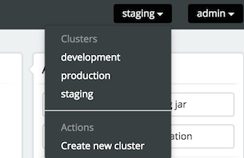
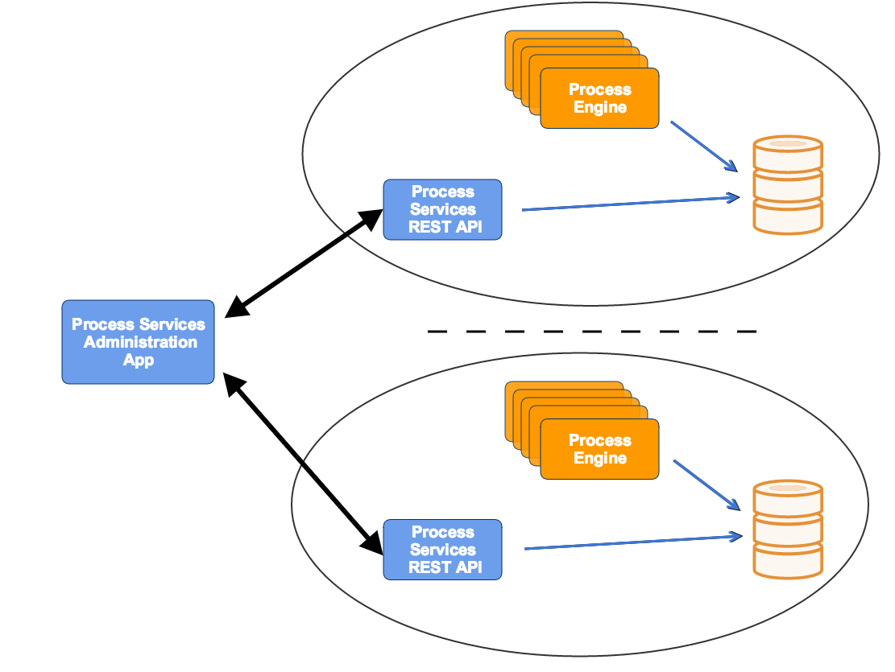
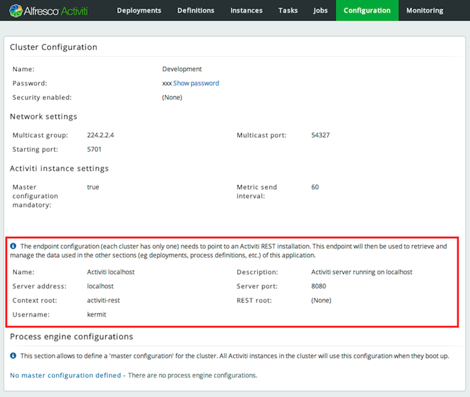

# Administrator architecture

Multiple clusters can be configured and managed through the Alfresco Process Services Administrator. This is displayed in the drop-down in the top-right corner:

**Each of the engines in a cluster should point to the same database schema**. To access the data of a cluster, the Administrator application uses one Alfresco Process Services REST application per cluster \(to avoid direct access to the database from the Administrator or potentially to manage different engine versions\).

The REST API endpoints can be included in your application using the Maven artifact com.activiti.activiti-rest. It is configured in a similar way as the Administrator.

No special setup is needed when using Alfresco Process Services, as it contains the necessary REST API endpoints out of the box.

As shown in the diagram below, any cluster can consist of multiple engine nodes \(pointing to the same database schema\), the data that is managed in the Administrator is fetched through an Alfresco Process Services REST application only.

In the same drop-down as shown above, a new cluster can be created. Note that a user will be created when doing so. This user is configured with the role of *cluster manager* and is used to send information to the HTTP REST API of the Administrator application, but it cannot log in into the Administrator application as a regular user for safety reasons.

The REST endpoint for each cluster can be configured through the Administrator. Simply change the settings for the endpoint on the *Configuration \> Engine* page while the cluster of choice is selected in the drop-down in the top-right corner. The current endpoint configuration is also shown on this page:

**Parent topic:**[Cluster configuration and monitoring](../topics/cluster_configuration_and_monitoring.md)

