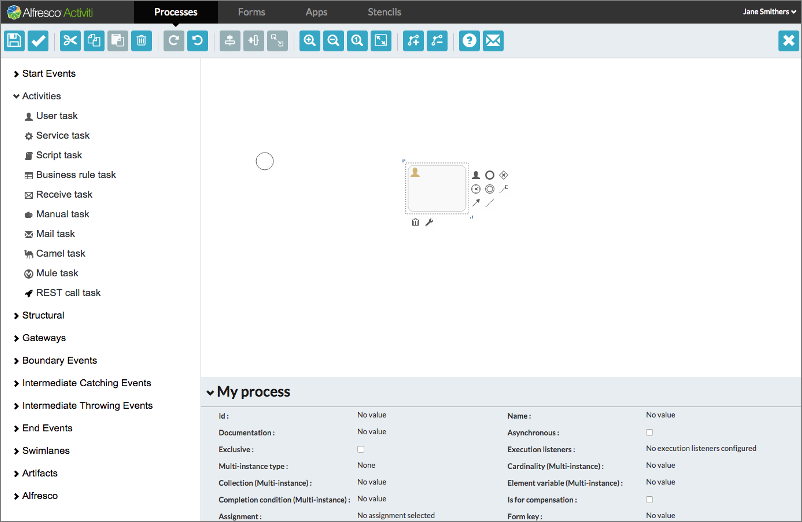

# BPMN editor

With the BPMN editor you can create process definitions using the capabilities of BPMN 2.0. You build your process by dragging and dropping from a palette of grouped components to a canvas on which your process diagram is built.

The BPMN editor is structured into several areas:

-   **Palette**

    On the left side of BPMN editor is the palette, which consists of collapse-able groups of BPMN objects.

-   **Canvas**

    On the right side of BPMN editor is the canvas, where the BPMN objects can be added to create a process model.

-   **Properties sheet**

    Below the canvas is the properties sheet, which shows the properties of the selected BPMN object on the canvas, or if no BPMN object is selected, the properties of the process itself. You can click on any of the properties to modify its value. The property sheet is collapse-able to allow you more screen space to view your process diagram.

-   **Toolbar**

    The toolbar is displayed on the top with a set of grouped command icons. You can save and validate your model, delete selected elements in the diagram, cut, copy and paste selected elements, undo and redo the last action, zoom the process diagram, eliminate crossing connector lines by adding and removing bend-points, view the BPMN editor tour, and provide feedback to the Alfresco Process Services team.

    When you first use the BPMN editor, a short guided tour runs showing you the components of the editor and running through the initial steps involved in creating a process definition. You can rerun the tour at any time by clicking the icon in the toolbar.

When you open the BPMN editor to create a new process definition, the canvas already contains a Start Event. Clicking on any event on the canvas frames the event icon with a dotted line and reveals a number of controls.

The controls below the icon allow you to delete the BPMN object, or change in to another object in the same group. For example, you can change a Start event to a Start timer event. The controls to the right of the icon allow you to specify the next object type in the process. The list presented includes only those object types that are valid in the sequence after the current object. In addition, there are controls that allow you to create flows connecting other existing events in your diagrams, and to annotate the event.

There are two ways of adding BPMN objects to your process:

-   Use the controls that appear when you click on a current object icon. Using this method will create a valid connector between the current event icon and the new event icon.

-   Drag and drop an object icon from the palette. In this case you add flows to the current event icons in the process yourself by picking the icons from the palette.

The following object groups are shown in a collapsible list in the palette. The groups consist of all the objects available in the BPMN 2.0 specification, and additional Alfresco Process Services extensions such as the Publish to Alfresco task, Publish to Box, Publish to Google Drive.

-   **[Start events](../topics/start_events.md)**  
 A start event indicates where a process starts. You can define a start event in one of the following ways:
-   **[Activities](../topics/activities.md)**  
An activity describes a single item of work to be performed in a process. Alfresco Process Services provides some Activity types that are additional to those described in the BPMN 2.0 specification.
-   **[Structural components](../topics/structural_components.md)**  
You use structural components to group multiple components in a sub process to reuse in a parent process definition, and to embed and call other process definitions from inside your own process.
-   **[Gateways](../topics/gateways.md)**  
You use gateways to control the flow of execution in your process.
-   **[Boundary events](../topics/boundary_events.md)**  
You use boundary events to handle an event associated with an activity. A boundary event is always attached to an activity.
-   **[Intermediate catching events](../topics/intermediate_catching_events.md)**  
An intermediate catching event is a step in the process where the process needs to wait for a specific trigger \(in BPMN this is described as *catching* semantics\).
-   **[Intermediate throwing events](../topics/intermediate_throwing_events.md)**  
 An intermediate throw event is used to explicitly throw an event of a certain type.
-   **[End events](../topics/end_events.md)**  
 You use an end event to signify the end of a process or sub-process, or the end of a path in a process or sub-process.
-   **[Swimlanes](../topics/swimlanes.md)**  
You use swimlanes to display activities in your process divided by business function or participant group. A process definition can have one swimlane diagram containing one pool, which in turn contains one or more lanes. The pool represents the whole process, and each lane corresponds to a business function or participant group.
-   **[Artifacts](../topics/artifacts.md)**  
You use artifacts to provide additional information about the process. The BPMN editor supports the text annotation artifact which associates additional text to an element in your process, or to the process itself. The text does not influence the execution of a process and is provided by the process designer to give information to the user of the process.
-   **[Alfresco Content Services actions](../topics/acs_actions.md)**  
 Use this section for actions specific to Alfresco Content Services content store:

**Parent topic:**[Process Services Landing Page](../concepts/Landing-page.md)

