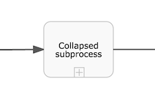

# Collapsed sub-process

You use a collapsed sub-process to add an existing process from your available process definitions as a sub-process to the process definition you are currently editing.

When you drag a collapsed sub-process from the palette to your canvas, and click on the Referenced Subprocess property, you are presented with a visual list of the process definitions you have access to. You can choose from the list, and the chosen process will be added to the current process definition. Note the process chosen must have exactly one none start event, and no other start event type, and it must have at least one end event.

Not that during process instance execution, there is no difference between a collapsed or embedded sub-process. They both share the full process instance context \(unlike the *call activity*\).

Note that when you click on the plus icon in a collapsed sub-process, the BPMN editor will open the referenced sub-process definition.

A collapsed sub-process is visualized as a rounded rectangle with a plus icon inside.

|Property|Description|
|--------|-----------|
|Id

|A unique identifier for this element.

|
|Name

|A name for this element.

|
|Documentation

|A description of this element instance.

|
|Referenced Subprocess

|The process definition this collapsed sub-process contains.

|
|Asynchronous

|\(Advanced\) Define this task as asynchronous. This means the task will not be executed as part of the current action of the user, but later. This can be useful if it’s not important to have the task immediately ready.

|
|Exclusive

|\(Advanced\) Define this task as exclusive. This means that, when there are multiple asynchronous elements of the same process instance, none will be executed at the same time. This is useful to solve race conditions.

|
|Execution listeners

|Execution listeners configured for this instance. An execution listeners is a piece of logic that is not shown in the diagram and can be used for technical purposes.

|
|Multi-Instance type

|Determines if this task is performed multiple times and how. The possible values are:

 -   **None**

The task is performed once only.

-   **Parallel**

The task is performed multiple times, with each instance potentially occurring at the same time as the others.

-   **Sequential**

The task is performed multiple times, one instance following on from the previous one.

|
|Cardinality \(Multi-instance\)

|The number of times the task is to be performed.

|
|Collection \(Multi-instance\)

|The name of a process variable which is a collection. For each item in the collection, an instance of this task will be created.

|
|Element variable \(Multi-instance\)

|A process variable name which will contain the current value of the collection in each task instance.

|
|Completion condition \(Multi-instance\)

|A multi-instance activity normally ends when all instances end. You can specify an expression here to be evaluated each time an instance ends. If the expression evaluates to true, all remaining instances are destroyed and the multi-instance activity ends.

|

**Parent topic:**[Structural components](../topics/structural_components.md)

