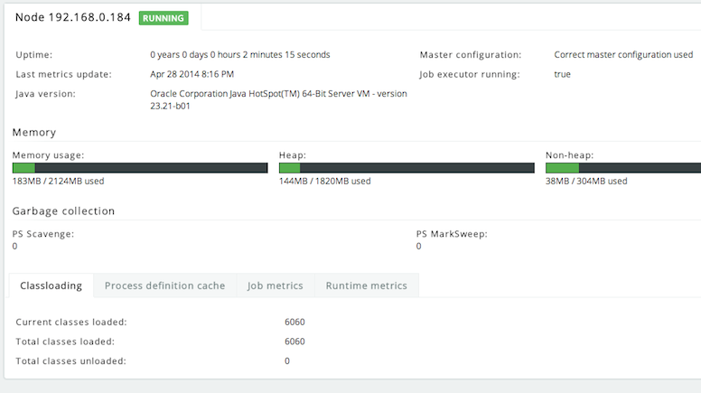

# Administrator configuration settings

The Process Engine and the Administrator app communicate through HTTP REST calls. To send or get information from the Administrator app, you must configure the Process Engine with a correct URL and credentials.

For the engine, this can be done programmatically:

```
processEngineConfig.enableClusterConfig();
processEngineConfig.setEnterpriseAdminAppUrl("http://localhost:8081/activiti-admin");
processEngineConfig.setEnterpriseClusterName("development");
processEngineConfig.setEnterpriseClusterUserName("dev");
processEngineConfig.setEnterpriseClusterPassword("dev");
processEngineConfig.setEnterpriseMetricSendingInterval(30);
```

This configures the base HTTP API URL, the name of the cluster that the engine is part of, the credentials of the user allowed to send data to the API and the time interval between sending data to the Administrator application \(in seconds\).

Alfresco Process Services includes the Process Engine. To enable engine clustering you can set the properties \(similar to the programmatical approach\) directly in the configuration file:

```
cluster.enable=true
cluster.config.adminapp.url=http://localhost:8081/activiti-admin
cluster.config.name=development
cluster.config.username=dev
cluster.config.password=dev
cluster.config.metricsendinginterval=30
```

Alfresco Process Services also sends extra metrics to the Administrator application. To configure the rate of sending, a cron expression can be set \(by default the same as the rate of sending for the Process Engine\):

```
cluster.config.app.metricsendingcronexpression=0/30 * * * * ?
```

Alternatively, you can generate a jar file with these settings through the *Configuration \> Generate cluster jar* button. If you place the jar file on the classpath \(or used as a Maven dependency if using a local Maven repository\) of an engine or Alfresco Process Services application, it will have precedence over the properties files.

Once the application is running, metrics for that node in the cluster are shown in the Admin application:



In the Admin application, the following two settings can be changed:

```
cluster.monitoring.max.inactive.time=600000
cluster.monitoring.inactive.check.cronexpression=0 0/5 * * * ?
```

-   `cluster.monitoring.max.inactive.time`: This a period of time, expressed in milliseconds, that indicates when a node is deemed to be inactive and is removed from the list of nodes of a cluster \(nor will it appear in the *monitoring* section of the application\). When a node is properly shut down, it will send out an event indicating it is shut down. From that point on, the data will be kept in memory for the amount of time indicated here. When a node is not properly shut down \(for example, hardware failure\), this is the period of time before removal, since the time the last event is received. Make sure the value here is higher than the sending interval of the nodes, to avoid that nodes incorrectly removed. By default 10 minutes.

-   `cluster.monitoring.inactive.check.cronexpression`: A cron expression that configures when the check for inactive nodes is made. When executed, this will mark any node that hasn’t been active for `cluster.monitoring.max.inactive.time` seconds, as an inactive node. By default, every 5 minutes.


**Parent topic:**[Cluster configuration and monitoring](../topics/cluster_configuration_and_monitoring.md)

