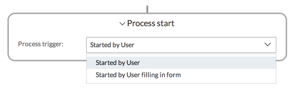
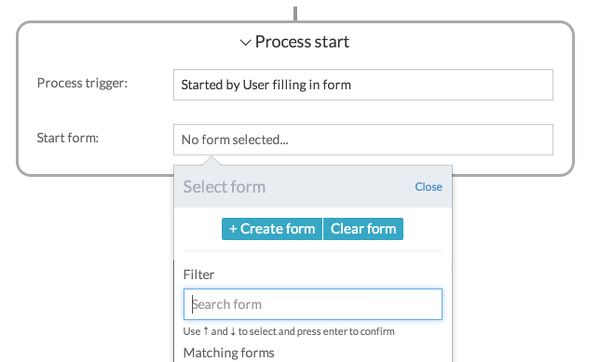
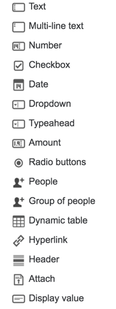
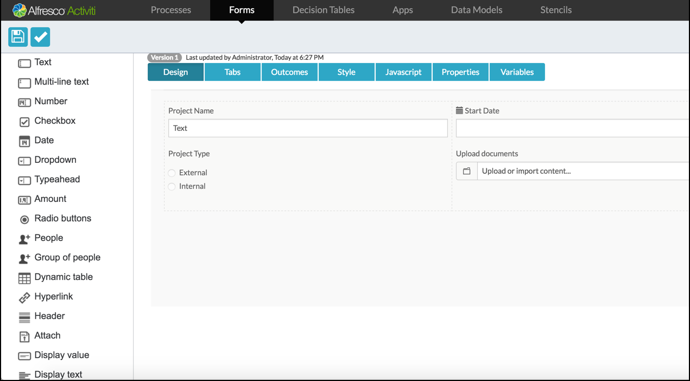
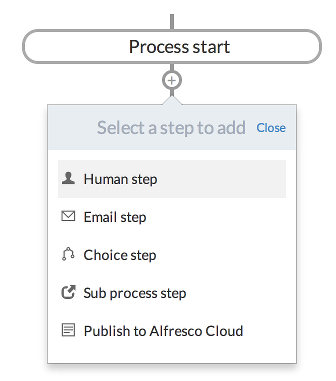
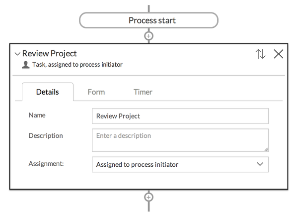

# Creating a process model

You can create a process model using the **Step Editor** or **BPMN Editor**.

**Step Editor** lets you define a business process through a sequence of steps. The **BPMN Editor** is a more powerful process design tool for creating BPMN 2.0 standard models.

Let’s start by creating a process model using the **Step Editor**:

1.  Click **Create Process**. The **Create a new business process model** dialog box appears.
2.  Type the **Name** and **Description** of your process model.
3.  Select the **Editor type** and **Stencil**.
4.  Click **Create new model**. The **Step Editor** page is displayed.

    By default, **Step Editor** includes a number of **Steps**, however this depends on the **Stencil** that you selected for editing the process model.

5.  Click **Process start** to expand and start by setting the process trigger to User filling a form.

    

6.  Click **Create form** to create a new form or select an existing form from your **Forms** library. The **Form Editor** is displayed.

    

    **Note:** Any form that’s created this way will not be available in your Forms library because it was created as part of this process model. To create a form that you can reuse in other process models, you must create it from the main **Forms** page. In this example, the form is defined in the **Step Editor**.

    The Forms editor has the following tabs:

    -   **Design** - Define the layout of form fields from the palette.

    -   **Tabs** - Customize tab names to display in the form.

    -   **Outcomes** - Define the outcome buttons for the form.

    -   **Style** - Define the style \(css\) for the form elements. For example, adding the following style in the Style panel will convert the field background to blue:

        ```
            .fields {
            background-color: blue;
        }
        ```

    -   **Javascript** - Define javascript code for an element in the form. For example:

        ```
        // __var currentUser = scope.$root.account;__
           __console.log(currentUser);__
          __alert ("Hello World!");__
        ```

    -   **Properties** - Define custom properties \(metadata\) for the form. This is particularly useful when using a custom form renderer \(Jave API or Rest API\) to retrieve the properties.

    -   **Variables** - Define variables in the form.

        You can design the form layout by dragging and dropping the required field type from the palette on the left to the form editor.

        

        For each field dropped in the **Design** area, you can hover over it and edit the field properties using the pencil icon. Alternatively, click **X** to remove a field from the form.

        **Note:** The options that become available in the edit view are determined by the field type selected from the palette. For example, a checkbox field has General, Visibility, and Style tabs, whereas a radio button field type might have an additional tab called Options.

        Add labels for the selected fields. Optionally, you can reference a display label with the value entered by a user running the process. In addition, you can also define if the field is required to be filled before the form can be completed.

        

7.  When you’ve finished designing the form, click **Save**. You’ll be returned to the **Step Editor**.
8.  Click the **+** \(plus\) icon at the bottom of the **Process start** box to add the first step in your process. The steps available to you are defined by the **Stencil** you associated the model with. The default stencil includes a **Human step** that can be used to assign a task to the user.
9.  Select the **Human step** and fill in a name within the step box that you just created.





You can also specify who this task should be assigned to. For example:

-   Someone who initiated the process

-   A single user

-   A set of candidate users or depending on the type of account, a group of users.


**Note:** When a task is assigned to a group or a list of candidate users, all of those users can see the task in their tasks list, however to complete the task they must claim it first.

-   **[Assigning tasks to a process](../topics/assigning_tasks.md)**  
To simplify a process, assign all tasks to the process initiator so that you can run the process and have the tasks assigned to yourself.
-   **[Creating a process app](../topics/creating_a_process_app.md)**  
 Now that we have a process defined, let’s create a process app using the **Apps** page.
-   **[Using My Tasks and Process Apps](../topics/using_my_tasks_and_process_apps.md)**  
A process app is a collection of processes that you want to group together to make them available to yourself or other users you share it with.
-   **[Using Involved Tasks](../tasks/group-task.md)**  
As well as allowing individual collaboration on a task, you can also involve groups. You can use this feature as an alternative to manually selecting multiple individuals when involving them with a task.

**Parent topic:**[Process Services Landing Page](../concepts/Landing-page.md)

