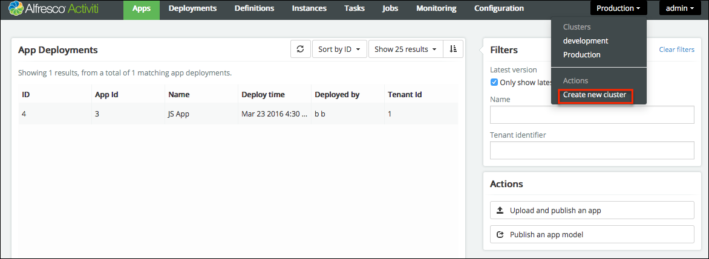

# Deploying apps

You can deploy apps in various ways in the Administrator application. For example, you can upload and publish an app model from a zip file, deploy an existing app from one cluster to another, or redeploy an existing app model to another cluster. Deploying app models to another cluster is particularly useful when your app needs to be progressed from staging to production or copied from the development environment to production. However, when any changes made to the development environment need to be carried over to production, you should select the target cluster \(the production system in this case\) in the Administrator application and redeploy your app.

-   To upload and publish an app model from a zip file, in the Administrator application, click **Apps** \> **Publish an app model**.

**Prerequisite**: Make sure you have configured at least two clusters. To create a new cluster, select **Clusters list** \> **Create new cluster**.

**To deploy an app model to a different cluster**:

1.  Go to **Admin App** \> **Apps** and then select an app model.
2.  Click **Publish an app model**. The Publish app model dialog box appears.
3.  Select **Publish app to another cluster** and select the cluster you want your app to be published to.
4.  Click **Publish**.

**To redeploy an existing app to a different cluster:**

1.  Go to **Admin App** \> **Apps** tab.
2.  Select the app that you need to move to a different cluster, and then click **Redploy an app to another cluster**. A dialog box to select a cluster appears.
3.  Select the cluster that you would like your app to be moved to, and then click **Deploy**. If the process app already exists, it is versioned and updated.

**To download an app:**

1.  Go to **Admin App** \> **Apps** tab.
2.  Select the app that you want to download.
3.  Click **Download app**.

**To delete an app**:

1.  Go to **Admin App** \> **Apps** tab.
2.  Select the app that you want to delete.
3.  Click **Delete App**.

**Parent topic:**[Using Administrator application](../topics/using_administrator_application.md)

