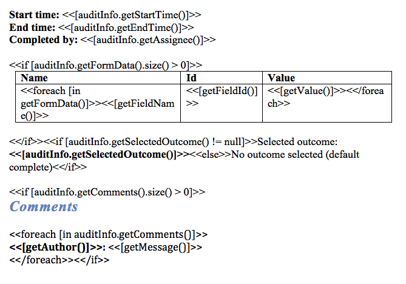

# Document Templates

Use the **Generate Document** task to generate a PDF or Microsoft Word document based on a Word document template \(.docx\). You can insert process variables in the MS Word template that will be replaced with actual values during document transformation.

A document template can be:

-   **Tenant wide**: Anyone can use this template in their processes. Useful for company templates.

-   **Process model specific**: This template is uploaded while modeling the process model, and is bound to the lifecycle of the process model.


When exporting an App model, process model document templates are included by default and are uploaded again on import. Tenant document templates are not exported, however matched by the document template name as names are unique for tenant document templates.

In the .docx template, you can insert process variables using the following syntax:

```
<<[myVariable]>>
```

Since the above method does not perform null checks, an exception will be thrown at run-time if the variable is null. Therefore, use the following method to prevent such errors:

```
<<[variables.get("myVariable")]>>
```

If this variable is null, a default value will be inserted instead. You can also provide a default value:

```
<<[variables.get("myVariable", "myDefaultValue")]>>
```

**Note: Form field types such as Dropdown, Radio button, and Typeahead use *myVariable\_ID* for ID and *myVariable\_LABEL* for label value. The ID is the actual value used by service tasks and are inserted by default. To display the label value in the generated document, use *myVariable\_LABEL*.**

The document generation method uses the libraries provided by Aspose in the back-end.

When using the **Generate Document** task, make sure to use the correct syntax for your variables and expressions. Surround your variables with <<\[..\]\>\> characters. For example:

*<<\[variableid\]\>\>*

*<<\[variables.get\("variableid"\)\]\>\>*

*<<\[variables.get\("variableid","adefaultifnull"\)*

Some more examples:

-   If/else conditional blocks:

    -   Text type: *<<if \[textfield==day\]\>\> AM, <<else\>\> PM \\<</if\>\>*

    -   Amount type: *<<if \[annualsalary \> $40000\]\>\>, it is generous, <<else\>\> a standard starting salary \\<</if\>\>*

    -   Checkbox: *<<if \[senstitiveflag=="true"\]\>\>it is Confidential, <<else\>\> Not Confidential \\<</if\>\>*

-   Date type: *<<\[datefield\]\>\>*

    -   Format date type: *<<\[datefield\]\>\>:"yyyy.MM.dd"\>\>*

-   Number/amount: *<<\[amountfield\]\>\>*

-   String Boolean: *<<\[Genericcheckbox\]\>\>*

-   Radio button / Typehead / dropdown: Select *<<\[Options\_LABEL\]\>\>* with an ID *<<\[Options\_ID\]\>\>*


The audit log is also generated the same way. For example, the following snippet from the template shows advanced constructs:



It is also possible to have custom Spring bean that processes the process variables just before rendering the document, [Processing document generation variables](processing_document_generation_variables.md).

**Parent topic:**[Developer guide](../topics/developmentGuide.md)

