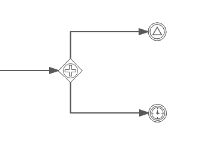

# Event based gateway

You use an event gateway to route process flow based on events.

Each outgoing sequence flow of the event gateway must be connected to an intermediate catching event. When process execution reaches an event gateway execution is suspended, and for each outgoing sequence flow, an event subscription is created. The flow for the event that occurs first, will be followed.

Outgoing sequence flows connect to an event gateway are never "executed", but they do allow the process engine to determine which events an execution arriving at an event-based gateway needs to subscribe to. The following restrictions apply to event gateways:

-   The gateway must have two or more outgoing sequence flows.

-   An event-based gateway can only be followed by intermediate catching events. Receive tasks after an event gateway are not supported by Alfresco Process Services.

-   An intermediate catching event connected to an event gateway must have a single incoming sequence flow.

An event gateway is visualized as a diamond shape with a plus icon inside. Unlike the parallel gateway, the plus icon is not colored black inside:

|Property|Description|
|--------|-----------|
|Id

|A unique identifier for this element instance.

|
|Name

|A name for this element instance.

|
|Documentation

|A description of this element instance.

|
|Asynchronous

|\(Advanced\) Define this task as asynchronous. This means the task will not be executed as part of the current action of the user, but later. This can be useful if it’s not important to have the task immediately ready.

|
|Exclusive

|\(Advanced\) Define this task as exclusive. This means that, when there are multiple asynchronous elements of the same process instance, none will be executed at the same time. This is useful to solve race conditions.

|
|Flow order

|Select the order in which the sequence flow conditions are evaluated.

|

**Parent topic:**[Gateways](../topics/gateways.md)

