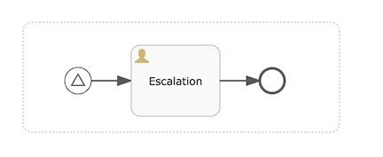

# Event sub-process

An event sub-process is a sub-process that is triggered by an event. You can use an event sub-process in your main process, or in any sub-process.

The event sub-process start event defines the event to be handled by the sub-process, so the type of start event you use must have an event associated with it – none start events are not supported but the event sub-processes. Your event sub-process can be started by a start message event, start signal event or a start error event. The subscription to the start event is created when the scope, process instance or sub-process, hosting the event sub-process is created. The subscription is removed when the scope is destroyed.

Your event sub-process does not have any incoming or outgoing sequence flows. An event sub-process is triggered by an event, so there can be no incoming sequence flow.

The best way to look at an event subprocess is as a *method* or *routine* that is called when something happens, and handle it appropriately.

An event sub-process is visualized like a sub-process with a dashed border.

|Property|Description|
|--------|-----------|
|Id

|A unique identifier for this element.

|
|Name

|A name for this element.

|
|Documentation

|A description of this element.

|
|Asynchronous

|\(Advanced\) Define this task as asynchronous. This means the task will not be executed as part of the current action of the user, but later. This can be useful if it’s not important to have the task immediately ready.

|
|Exclusive

|\(Advanced\) Define this task as exclusive. This means that, when there are multiple asynchronous elements of the same process instance, none will be executed at the same time. This is useful to solve race conditions.

|
|Execution listeners

|Execution listeners configured for this instance. An execution listeners is a piece of logic that is not shown in the diagram and can be used for technical purposes.

|

**Parent topic:**[Structural components](../topics/structural_components.md)

