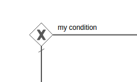

# Exclusive gateway

You use an exclusive gateway to model a decision in your process. When execution arrives at an exclusive gateway, the outgoing sequence flows are evaluated in the order in which they are defined. The first sequence flow whose condition evaluates to true, or which does not have a condition set, is selected and the process continues.

An exclusive gateway is visualized as a diamond shape with an X inside.

Note that if no sequence flow is selected, an exception will be thrown.

|Property|Description|
|--------|-----------|
|Id

|A unique identifier for this element.

|
|Name

|A name for this element.

|
|Documentation

|A description of this element.

|
|Asynchronous

|\(Advanced\) Define this task as asynchronous. This means the task will not be executed as part of the current action of the user, but later. This can be useful if it’s not important to have the task immediately ready.

|
|Exclusive

|\(Advanced\) Define this task as exclusive. This means that, when there are multiple asynchronous elements of the same process instance, none will be executed at the same time. This is useful to solve race conditions.

|
|Flow order

|Select the order in which the sequence flow conditions are evaluated. The first sequence flow that has a condition that evaluates to true \(or has no condition\) will be selected to continue.

|

**Parent topic:**[Gateways](../topics/gateways.md)

