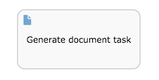

# Generate document task

The generate document task generates a document \(Word or PDF\) and stores the reference to the document as a process variable. The document is based on a \(Word\) template that describes how the document needs to be rendered, using process variables and various constructs \(such as if-clauses and loops\). See the Developer Guide on how to use the generate document task.

A generate document task appears as a rounded rectangle with a document icon on the top-left corner.

|Property|Description|
|--------|-----------|
|Id

|A unique identifier for this element.

|
|Name

|A name for this element.

|
|Documentation

|A description of this element.

|
|Template

|The template upon which is used to generate the document. It can be uploaded as part of the process definition, or can be defined company-wide by an administrator and reused by various process definitions.

|
|Output format

|The document format, PDF or Word.

|
|Document variable

|This is the process variable in which the reference to the generated document is stored.

|

**Parent topic:**[Activities](../topics/activities.md)

