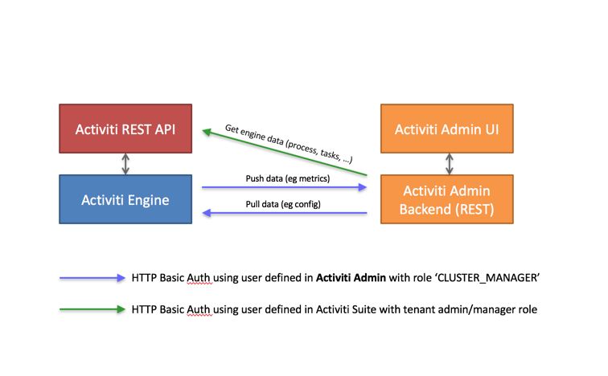
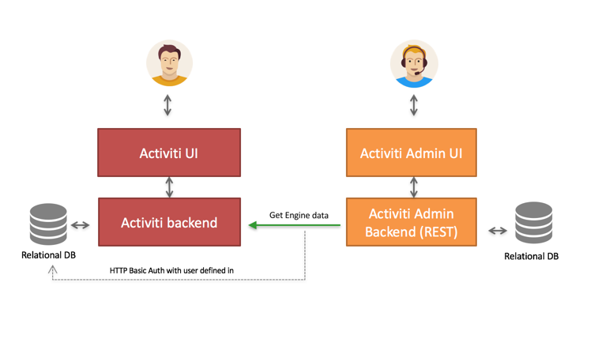
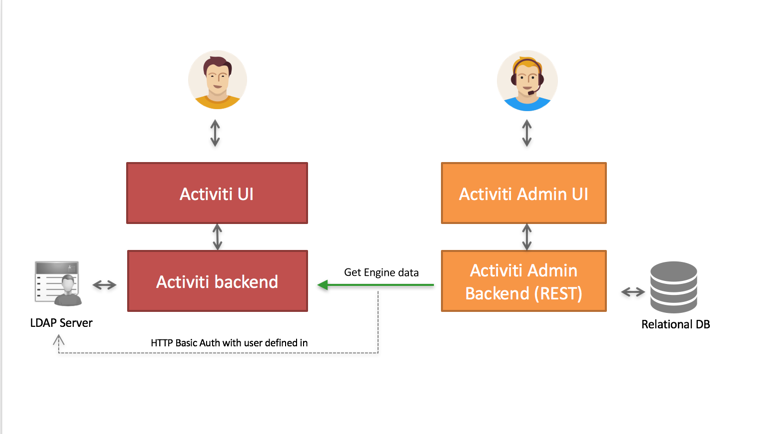

# HTTP communication with Administrator

Communication with the Administrator Application is done using HTTP REST calls. The calls use HTTP Basic Authentication for security, but do use different users, depending on the user case.

Alfresco Process Servicesand the Administrator Application do not share user stores. The reason being:

-   There are only a handful of users typically involved with the Administrator Application.

-   The Administrator Application can be used independently.

The following pictures gives a high-level overview:

-   The Process Engine pushes and pulls data to and from the Administrator Application REST API. These calls use basic authentication with a user defined in the Administrator Application user store \(relational database\). Such a user is automatically created when a new cluster configuration is created \(see above\), but its credentials need to be configured on the engine/Suite app side \(see the *cluster.xx* properties.\)

-   The Administrator Application allows you to browse and manage data in an Enterprise Process Engine. It calls the REST API to do so, using a user defined in the user store of the Suite Application \(or any other authentication mechanism for the embedded engine use case\).

For Alfresco Process Services: The user needs to have a *Tenant Admin* or *Tenant Manager* role, as the Administrator Application gives access to all data of the engine.

The following diagram illustrates what this means for an end user:

An end user logs in through the UI, both on the Suite as the Admin Application. Again, the user store is not shared between the two.

It’s important to understand that the HTTP REST calls done against the Suite REST API, are done using the credentials of the Suite application using a user defined in the user store of the Suite Application. This user can be configured through the Administrator Application UI.

In case of using LDAP, a equivalent reasoning is made:

The user that logs into the Administrator Application is defined in the relational database of the Administrator Application. However, the HTTP REST call will now use a user that is defined in LDAP.

**Parent topic:**[Installing Alfresco Process Services Administrator](../topics/installing_administrator.md)

