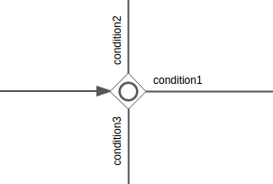

# Inclusive gateway

You use an inclusive to join and fork multiple sequence flows based on conditions.

Like an exclusive gateway you can define conditions on outgoing sequence flows and the inclusive gateway will evaluate them, but an inclusive gateway can take more than one sequence flow, like the parallel gateway.

All outgoing sequence flow conditions are evaluated. Every sequence flow with a condition that evaluates to true, is followed in parallel, creating one concurrent execution for each sequence flow.

The join behavior for an inclusive gateway is more complex than the parallel gateway counterparts. All concurrent executions arriving at the inclusive gateway wait at the gateway until executions that *can* reach the inclusive gateway have reached the inclusive gateway. To determine this, all current executions of the process instance are evaluated, checking if there is a path from that point in the process instance to the inclusive gateway. \(ignoring any conditions on the sequence flow\). When one such execution is found, the inclusive gateway join behavior does not activate.

An inclusive gateway is visualized as a diamond shape with a circle icon inside:

Note that an inclusive gateway can have both fork and join behavior, in which case there are multiple incoming and outgoing sequence flows for the same inclusive gateway. The gateway will join all incoming sequence flows that have a process token, before splitting into multiple concurrent paths of executions for the outgoing sequence flows that have a condition that evaluates to true.

|Property|Description|
|--------|-----------|
|Id

|A unique identifier for this element instance.

|
|Name

|A name for this element instance.

|
|Documentation

|A description of this element instance.

|
|Asynchronous

|\(Advanced\) Define this task as asynchronous. That is, the task will not be executed as part of the current action of the user, but later. This can be useful if it’s not important to have the task immediately ready.

|
|Exclusive

|\(Advanced\) Define this task as exclusive. That is, when there are multiple asynchronous elements of the same process instance, none will be executed at the same time. This is useful to solve race conditions.

|
|Flow order

|Select the order in which the sequence flow conditions are evaluated. This is of less importance as for the exclusive gateway, as all outgoing sequenceflow conditions will be evaluated anyway.

|

**Parent topic:**[Gateways](../topics/gateways.md)

