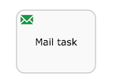

# Mail task

You can enhance your business process with this automatic mail service task that sends emails to one or more recipients. The task supports normal email features such as cc lists, bcc lists, and HTML content.

The mail task is depicted as a rounded rectangle with an envelope icon in the top-left corner.

|Property|Description|
|--------|-----------|
|Id

|A unique identifier for this element.

|
|Name

|A name for this element.

|
|Documentation

|A description of this element.

|
|To

|The recipient of the e-mail. You can specify multiple recipients in a comma-separated list. When using a fixed value, this can be an expression. It is also possible, like with the user task, to use the *Identity store* option here to pick users that are known in the system or to reference people that were selected in form fields prior to this email task.

|
|From

|The sender’s email address. If you do not specify this, the default configured system-wide setting *from* address is used. This can be an expression.

|
|Subject

|The subject of this email. This can be an expression.

|
|Cc

|The cc list for this email. You can specify multiple recipients in a comma-separated list. This can be an expression.

|
|Bcc

|The bcc list for this email. You can specify multiple recipients in a comma-separated list. This can be an expression.

|
|Text

|The text content of this email. You can specify this as well as HTML to support email clients that do not support rich content. The client will fall back to this text-only alternative.

|
|Html

|The HTML content of this email.

|
|Charset

|The charset for this email. By default UTF8 will be used.

|
|Asynchronous

|\(Advanced\) Define this task as asynchronous. This means the task will not be executed as part of the current action of the user, but later. This can be useful if it’s not important to have the task immediately ready.

|
|Exclusive

|\(Advanced\) Define this task as exclusive. This means that, when there are multiple asynchronous elements of the same process instance, none will be executed at the same time. This is useful to solve race conditions.

|
|Execution listeners

|Execution listeners configured for this instance. An execution listeners is a piece of logic that is not shown in the diagram and can be used for technical purposes.

|
|Multi-Instance type

|Determines if this task is performed multiple times and how. The possible values are:

 -   **None**

The task is performed once only.

-   **Parallel**

The task is performed multiple times, with each instance potentially occurring at the same time as the others.

-   **Sequential**

The task is performed multiple times, one instance following on from the previous one.

|
|Cardinality \(Multi-instance\)

|The number of times the task is to be performed.

|
|Collection \(Multi-instance\)

|The name of a process variable which is a collection. For each item in the collection, an instance of this task will be created.

|
|Element variable \(Multi-instance\)

|A process variable name which will contain the current value of the collection in each task instance.

|
|Completion condition \(Multi-instance\)

|A multi-instance activity normally ends when all instances end. You can specify an expression here to be evaluated each time an instance ends. If the expression evaluates to true, all remaining instances are destroyed and the multi-instance activity ends.

|
|Is for compensation

|If this activity is used for compensating the effects of another activity, you can declare it to be a compensation handler. For more information on compensation handlers see the Developer Guide.

|

**Parent topic:**[Activities](../topics/activities.md)

