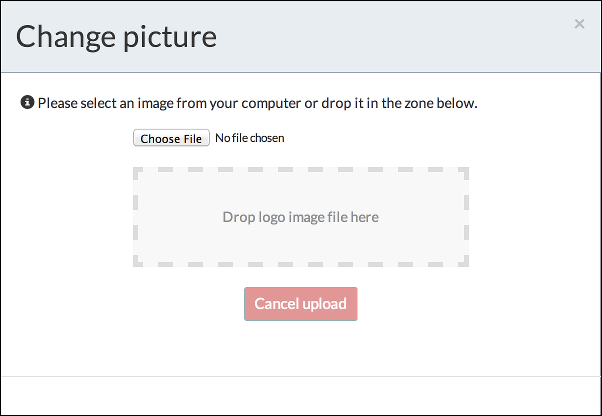

# Personal profile

You can add a photo to your profile.

To edit your profile, click **Profile management**.

On the **Personal** page you can edit your details, such as your name, change your password, and view your group membership and capabilities.

To add your photo, click the image to the left of your name and upload the desired photo.

**Parent topic:**[Process Services Landing Page](../concepts/Landing-page.md)

