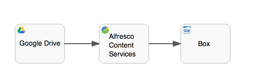

# Publish to Alfresco task / Box / Google Drive

The publish task enables you to publish items that were created or modified during process instance execution to a content store. Currently, the following content stores are supported:

-   Alfresco Content Services or Alfresco in the Cloud

-   Box

-   Google Drive

A publish task is depicted as a rounded rectangle with the icon of the content store on the top-left corner.

|Property|Description|
|--------|-----------|
|Id

|A unique identifier for this element.

|
|Name

|A name for this element.

|
|Documentation

|A description of this element.

|
|Alfresco / Box / Google Drive Content

|Configures what content to publish. You can select a previously defined form field or all the content that was updated during the process instance execution.

|
|Alfresco / Box / Google Drive Destination

|Configures where the content will be published to. You can publish the content using the process initiator or a specific user \(this is important when it comes to permissions in the content store\).

|

**Parent topic:**[Alfresco Content Services actions](../topics/acs_actions.md)

