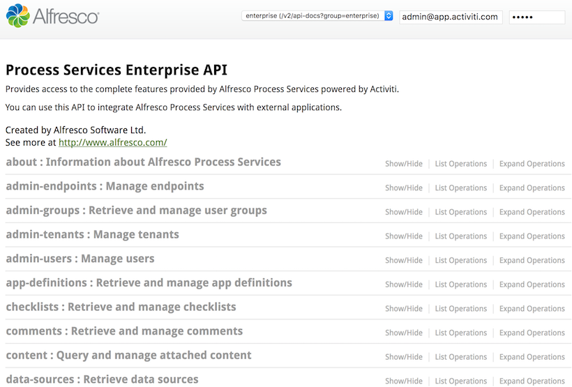
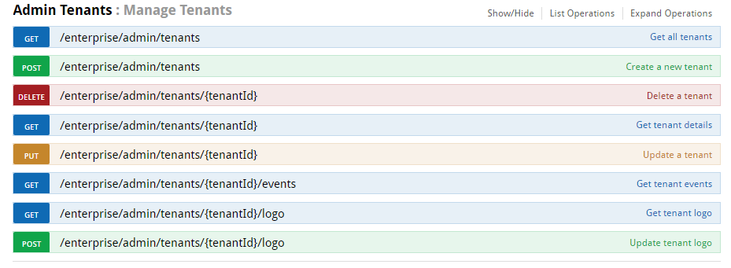
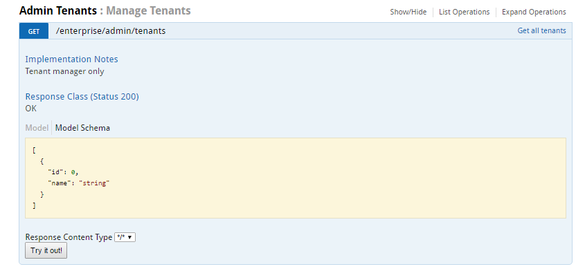
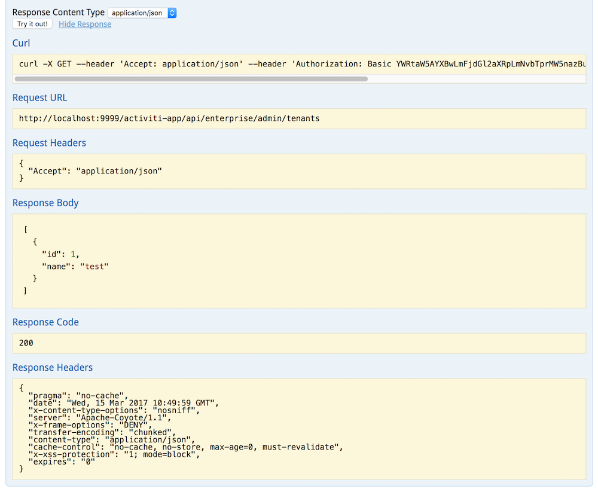

# Using the REST API Explorer

Alfresco Process Services comes with a built-in REST API Explorer. This lets you discover and test the REST APIs of a locally running Process Services instance.

The REST API Explorer is based on the [OpenAPI \(Swagger\) initiative](https://openapis.org/) and provides an interface for the REST API. You can browse the available API endpoints and test operations available within a particular API group.

Access the REST API Explorer with the link: [http://localhost:8080/activiti-app/api-explorer.html](http://localhost:8080/activiti-app/api-explorer.html).

There is also a public [REST API Explorer](https://activiti.alfresco.com/activiti-app/api-explorer.html).

This screenshot shows what the REST API Explorer looks like:

Click on a link to view the available operations for a particular group of APIs.

For example, to explore the operations on a specific entity, **Admin Tenants: Manage Tenants API**, just click on it:

Click on an operation to test it against the locally running Process Services instance.

When you click **Try it out!**, you'll see the following response:

**Parent topic:**[REST API](../topics/rest_api.md)

