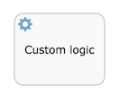

# Service task

Use a service task to invoke an external Java class or execute an expression \(for example to call a Spring bean\).

A service task is visualized as a rounded rectangle with a cog icon inside.

|Property|Description|
|--------|-----------|
|Id

|A unique identifier for this element instance.

|
|Name

|A name for this element.

|
|Documentation

|A description of this element.

|
|Class

|The name of the Java class that implements your service task. Your class must implement `JavaDelegate` or `ActivityBehavior`. For more information on methods of invoking Java logic from a service task see the Developer Guide

|
|Expression

|An expression that either executes logic in the expression itself \(for example *$\{execution.setVariable\(*myVar*, *someValue*\)\}*\) or calls a method on a bean known by the Activiti engine \(for example *$\{someBean.callMethod\}*\). You can pass parameters \(like the current *execution*\) to the method in the expression. For more information on methods of invoking Java logic from a service task see the Developer Guide.

|
|Delegate expression

||
|Class

|Field extensions for the service task.

|
|Result variable name

|The name of a process variable in your process definition in which to store the result of this service task. This is only valid when using an *expression*.

|
|Execution listeners

|Execution listeners configured for this instance. An execution listeners is a piece of logic that is not shown in the diagram and can be used for technical purposes.

|
|Multi-Instance type

|Determines if this task is performed multiple times and how. For more information on multi-instance, see the Developer documentation. The possible values are:

 -   ****None****

The task is performed once only.

-   ****Parallel****

The task is performed multiple times, with each instance potentially occurring at the same time as the others.

-   ****Sequential****

The task is performed multiple times, one instance following on from the previous one.

|
|Cardinality \(Multi-instance\)

|The number of times the task is to be performed.

|
|Collection \(Multi-instance\)

|The name of a process variable which is a collection. For each item in the collection, an instance of this task will be created.

|
|Element variable \(Multi-instance\)

|A process variable name which will contain the current value of the collection in each task instance.

|
|Completion condition \(Multi-instance\)

|A multi-instance activity normally ends when all instances end. You can specify an expression here to be evaluated each time an instance ends. If the expression evaluates to true, all remaining instances are destroyed and the multi-instance activity ends.

|
|Is for compensation

|If this activity is used for compensating the effects of another activity, you can declare it to be a compensation handler. For more information on compensation handlers see the Developer Guide.

|
|Asynchronous

|\(Advanced\) Define this task as asynchronous. This means the task will not be executed as part of the current action of the user, but later. This can be useful if it’s not important to have the task immediately ready.

|
|Exclusive

|\(Advanced\) Define this task as exclusive. This means that, when there are multiple asynchronous elements of the same process instance, none will be executed at the same time. This is useful to solve race conditions.

|

For a service task it is recommended to make them asynchronous. For example, suppose a service task is called after the user completes a form. When the service task is synchronous, the logic will be executed during the completion action of the user. This means the user has to wait until this logic is finished to have the UI refreshed. Often, this is not needed or wanted. By making the service task asynchronous, the UI will be refreshed when the task is completed. The logic will be executed later.

**Parent topic:**[Activities](../topics/activities.md)

