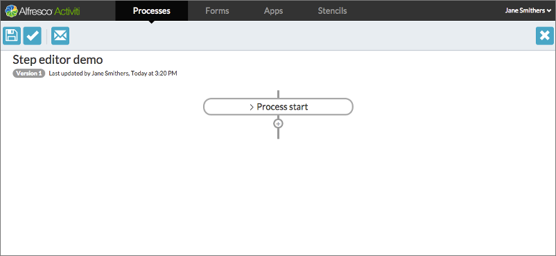
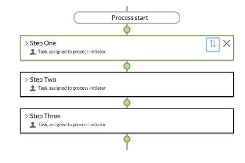
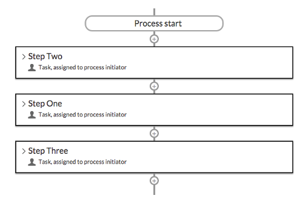

# Step editor

The Step Editor guides you through creating a business process through a sequence of simple steps. The processes you create using the step editor do not exploit the full power of BPMN 2.0 like those created by the BPMN editor, but you can use it to design both simple and quite complex process models, without knowledge of BPMN 2.0.

The editor has a menu bar with buttons to save your model, validate that the model is a complete BPMN 2.0 model definition, provide feedback to the Alfresco Process Services team, and to close the editor.

When you open the step editor on a new process definition, you can see the first step, the Process start step is already added to the process diagram for you. When you mouse-over a step, the stop becomes click-able. Click on it, and the details of the step are displayed and can be edited. This design principle is reflected throughout the Alfresco Process Services app. You can mouse-over and click text areas to modify their content, and variables to change their values. So for the Process start step, you can click on the single Process trigger variable and choose the trigger type:

The editor will guide you in creating your process. For example, when a form is required, it will present you with a list of existing forms and provide you with a button to create a new form. So for example if you choose the Started by User filling in form option for the Process trigger variable in the Process start step, you would see the following dialog:

Below the last step in a sequence, there is a + \(plus\) icon. Click on this to add a step to your process.

You can move steps around in your process Click in the top-right of the step and the step will be outlined in green, and the + icons will change to green discs.

Click the green disk at which you want your highlighted step to move, and the step is moved to that position in the flow:

In addition to the Process start step, there are five types of step you can add to your process.

-   **[Human step](../topics/human_step.md)**  
A human step is a task to be completed by a user. You choose who to assign the task to, provide a form for that user to complete, define a due date for the task, and set a timer. If a timer is triggered, it will allow Alfresco Process Services to take an action related to the task, such as reassign it to another user and so on.
-   **[Email step](../topics/email_step.md)**  
When an email step starts in a running process, it sends an email with a fixed text body and a fixed title to a single or multiple recipients.
-   **[Choice step](../topics/choice_step.md)**  
A choice step enables you to start one of two or more sequences of substeps for your process, based on conditions.
-   **[Sub process Step](../topics/sub_process_step.md)**  
A sub process step enables you to create a step that itself contains a sequence of steps that constitute a complete process definition. When saved, this definition is added to the list of substeps available to your main process definition. This gives you a method of managing complex processes by refining repeated sequences of steps into a sub step. This can make your process definition easier to comprehend visually.
-   **[REST call](../topics/rest_call.md)**  
This step allows you make an arbitrary REST call. You can define a full endpoint directly or use an endpoint defined by an administrator on your Alfresco Process Services server. You can supply parameters to the call directly in the URL or from process variables in forms, and you can extract properties from the JSON response into process variables for use in your process definition.
-   **[Generate document](../topics/generate_document.md)**  
Use this step to generate a Microsoft Word or PDF document from a template in Microsoft Word. The process step will substitute any variables you place in the template document with process and form variables. You can upload global template documents for use by all users, or upload personal template documents for your own use.
-   **[Decision step](../topics/decision_step.md)**  
The decision step enables you to create a Decision Table. A decision table is an easier expression to creating business rules.
-   **[Content-related steps](../topics/content_related_steps.md)**  
 Use this section to link create content related steps.

**Parent topic:**[Process Services Landing Page](../concepts/Landing-page.md)

