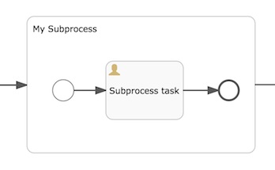

# Sub-process

A sub process is a single activity that contains activities, gateways, and events which form a process. A sub process is completely embedded inside a parent process.

A sub-process is visualized as a rounded rectangle:

You can use a sub process to create a new scope for events. Events that are thrown during execution of the sub process, can be caught by [Boundary events](boundary_events.md) on the boundary of the sub process, creating a scope for that event limited to just the sub process.

Sub-processes must have the following characteristics:

-   A sub process has exactly one none start event. No other start event types are permitted. A sub process must have at least one end event.

-   Sequence flow cannot cross sub process boundaries.

|Property|Description|
|--------|-----------|
|Id

|A unique identifier for this element.

|
|Name

|A name for this element.

|
|Documentation

|A description of this element.

|
|Asynchronous

|\(Advanced\) Define this task as asynchronous. This means the task will not be executed as part of the current action of the user, but later. This can be useful if it’s not important to have the task immediately ready.

|
|Exclusive

|\(Advanced\) Define this task as exclusive. This means that, when there are multiple asynchronous elements of the same process instance, none will be executed at the same time. This is useful to solve race conditions.

|
|Execution listeners

|Execution listeners configured for this instance. An execution listeners is a piece of logic that is not shown in the diagram and can be used for technical purposes.

|
|Multi-Instance type

|Determines if this task is performed multiple times and how. The possible values are:

 -   **None**

The task is performed once only.

-   **Parallel**

The task is performed multiple times, with each instance potentially occurring at the same time as the others.

-   **Sequential**

The task is performed multiple times, one instance following on from the previous one.

|
|Cardinality \(Multi-instance\)

|The number of times the task is to be performed.

|
|Collection \(Multi-instance\)

|The name of a process variable which is a collection. For each item in the collection, an instance of this task will be created.

|
|Element variable \(Multi-instance\)

|A process variable name which will contain the current value of the collection in each task instance.

|
|Completion condition \(Multi-instance\)

|A multi-instance activity normally ends when all instances end. You can specify an expression here to be evaluated each time an instance ends. If the expression evaluates to true, all remaining instances are destroyed and the multi-instance activity ends.

|

**Parent topic:**[Structural components](../topics/structural_components.md)

