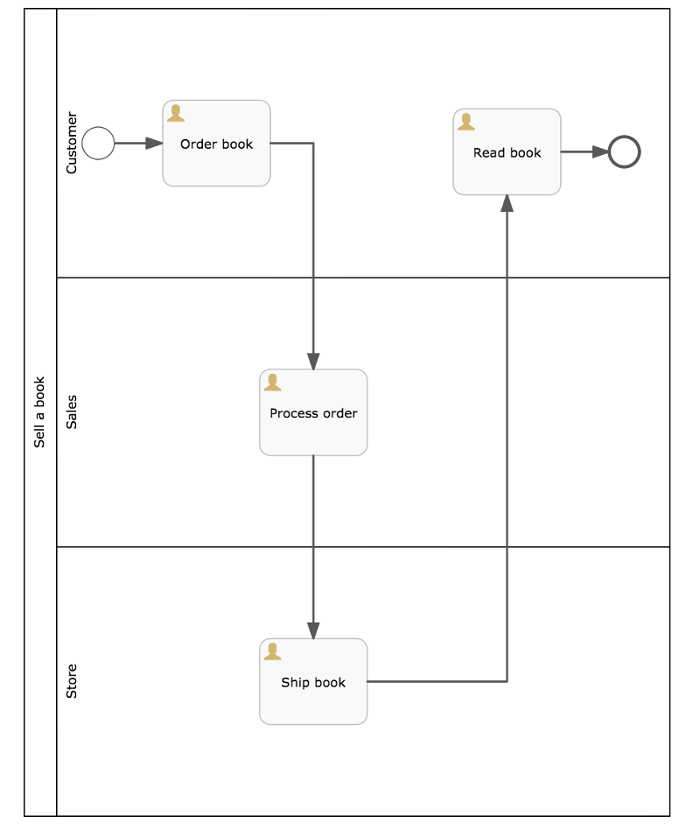

# Swimlanes

You use swimlanes to display activities in your process divided by business function or participant group. A process definition can have one swimlane diagram containing one pool, which in turn contains one or more lanes. The pool represents the whole process, and each lane corresponds to a business function or participant group.

For example, the process of selling a book consists of several activities: ordering a book, processing the order, shipping the book, and reading the book. However, the activities are performed by participants in different groups: by the customer, by the sales department, by the warehouse, or store. In the following diagram, process definitions have one pool called Sell a book with three lanes: Customer, Sales, and Store. The process sequence flow moves between lanes in the pool as the order progresses.

When you drag a pool to your process diagram, it creates an unnamed pool containing one unnamed lane. You can add lanes by dragging a lane icon from the palette to the canvas. When you hover over the name box of the pool, the whole pool border turns green, indicating the lane will be added to the pool when you release the mouse button.

**Parent topic:**[BPMN editor](../topics/bpmn_editor.md)

