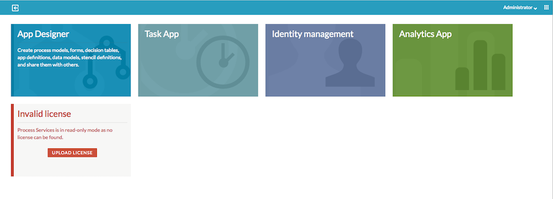
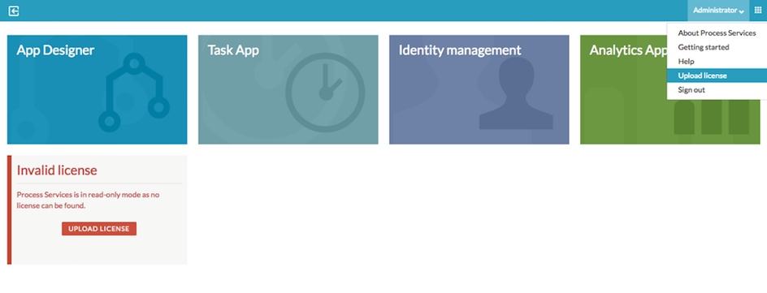
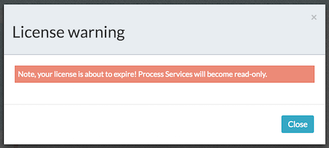

# Uploading a license from the Landing Page

To use the license upload feature, add that capability to the appropriate user. Typically an administrator has the capability to add licenses from the **Identity management** app \> **Capabilities** tab.

You can upload the license file from the user interface using one of the two methods:

-   **Option 1: Landing page**

-   **Option 2: User menu**

**To upload the license file from the landing page:**

1.  Start Alfresco Process Services.
2.  From the **Landing page** \> **Invalid license** tile, click **Upload License**. A dialog box appears to locate the license file from your computer.
3.  Select the file and click **Upload**. The new license will be applied to your repository.

**To upload the license file from the User menu:**

1.  Start Alfresco Process Services.
2.  Expand the User menu and click **Upload license**. A dialog box appears to locate the license file from your computer.
3.  Select the file and click **Upload**. The new license will be applied to your repository.

**Note:** When the license is in the final month of its duration period, a pop-up message appears on login, warning that the license is about to expire and that the application will become read-only.

Click **Close** and then continue to use the application. The message will only reappear when you have logged out and logged back in again.

**Note:** This message is only displayed when you are logged in as the Alfresco Process Services administrator.

**Parent topic:**[Installing Alfresco Process Services](../topics/installing_process_services.md)

